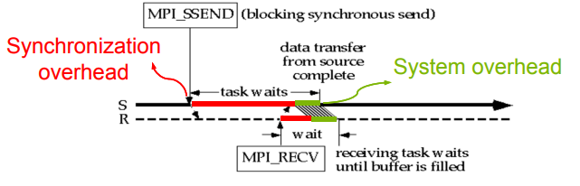
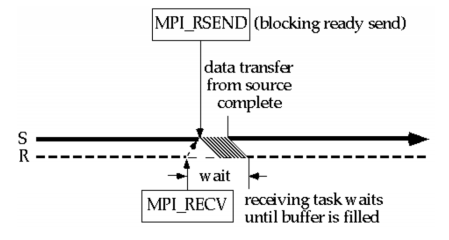
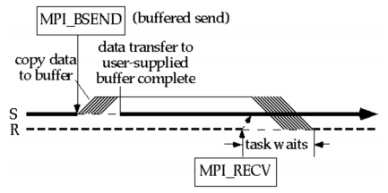
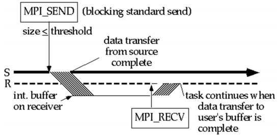
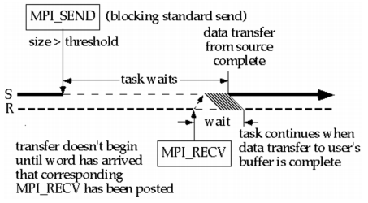
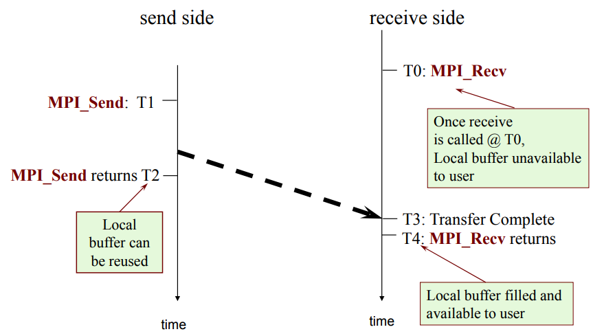
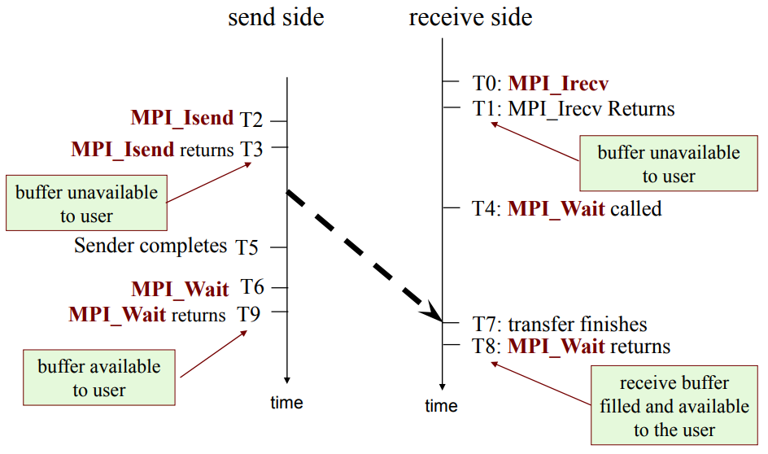

# Message Passing Interface

## Table of Content

* [Message Passing Interface](#message-passing-interface)
  * [Table of Content](#table-of-content)
  * [Multithreading vs Message Passing](#multithreading-vs-message-passing)
  * [Taxonomy of Parallel Architectures](#taxonomy-of-parallel-architectures)
  * [Introduction](#introduction)
  * [MPI Standard](#mpi-standard)
  * [MPI‐1 Model and Basic Calls](#mpi%e2%80%901-model-and-basic-calls)
  * [MPI Communicators](#mpi-communicators)
  * [Point to Point Communication](#point-to-point-communication)
  * [Point to Point Communication in‐depth](#point-to-point-communication-in%e2%80%90depth)
    * [Blocking Synchronous Send](#blocking-synchronous-send)
    * [Blocking Ready Send](#blocking-ready-send)
    * [Blocking Buffered Send](#blocking-buffered-send)
    * [Blocking Standard Send](#blocking-standard-send)
    * [Buffered Standard Send](#buffered-standard-send)
    * [Non-blocking Calls](#non-blocking-calls)
    * [Difference Between Blocking and Non-blocking](#difference-between-blocking-and-non-blocking)
  * [Deadlock](#deadlock)
  * [Trapezoidal Rule : A Case Study](#trapezoidal-rule--a-case-study)
  * [Using MPI & Jumpshot to profile parallel applications](#using-mpi--jumpshot-to-profile-parallel-applications)
  * [Summary](#summary)

## Multithreading vs Message Passing

* multithreading
  * initial parallelization can be easy
  * difficult for debugging and optimization
  * shared address space + semaphores + race free = NP-complete
* message passing
  * extra work upfront
  * easier debugging and less time to solution

## Taxonomy of Parallel Architectures

* UMA: Uniform Memory Access
* COMA: Cache Only Memory Access
* NUMA: Non Uniform Memory Access
  * CC-NUMA: Cache Coherent NUMA
  * NC-NUMA: No Cache NUMA
* MPP: Massively Parallel Processor
* COW: Cluster of Workstations

## Introduction

* opening remarks
* what you'll need to know

## MPI Standard

* MPI-1.0: 1994
  * An API
  * FORTRAN77 and C bindings
  * mpich developed
  * vendors kept their own internals
  * SPMD
* MPI-1.1
* MPI-2.0: 1997
  * extended MPI: new datatype ctors, language interoperability
  * new functionality
    * one-sided communication
    * MPI I/O
    * dynamic processes
  * FORTRAN90 and C++ bindings
* MPI-3.0: 2012
  * hardware-portable, multi-language communication library
* implementations
  * MPICH
  * Open MPI

## MPI‐1 Model and Basic Calls

``` C
int MPI_Init(int *argc, char ***argv);

int MPI_Finalize()
```

* build: use mpicc + Open MPI
  * `mpicc --showme:compile`
  * `mpicc --showme:link`
* run
  * `mpiexec -n 8 ./a.out`
  * `mpiexec -n 8 -host node1,node2 ./a.out`
  * `mpiexec -n 8 -hostfile <hostfile> ./a.out`
  * higher level scripts: PBS/LoadLeveler
  * e.g.

PBS

``` bash
#!/bin/bash
#PBS ‐N hello
#PBS ‐l walltime=00:01:00,nodes=2:ppn=4
cd /home/hua/Desktop/learn_pp/mpi
pwd
date
PROCS=`wc ‐l < $PBS_NODEFILE`
mpdboot ‐f $PBS_NODEFILE
mpiexec ‐n $PROCS ./hello
mpdallexit
date
```

LoadLeveler

``` bash
#!/bin/bash
#@ job_type = parallel
#@ job_name = SIMID
#@ wall_clock_limit = 120:00:00
#@ node = 8
#@ total_tasks = 32
#@ initialdir = /scratch/cdekate/
#@ executable = /usr/bin/poe
#@ arguments = /scratch/cdekate/padcirc
#@ queue
```

* [mpi1_hello.c](mpi1_hello.c)

## MPI Communicators

* each process has its own address space
* default communicator: MPI_COMM_WORLD
* each process has a unique rank in a communicator

``` C
int MPI_Comm_size(MPI_Comm comm, int *size);

int MPI_Comm_rank(MPI_Comm comm, int *rank);
```

* [mpi2_communicator.c](mpi2_communicator.c)

## Point to Point Communication

* message contains
  * envelope
    * rank of receiver
    * rank of sender
    * tag
    * communicator
  * data
* MPI_Datatype
  * MPI_CHAR
  * MPI_SHORT
  * MPI_INT
  * MPI_LONG
  * MPI_UNSIGNED_CHAR
  * MPI_UNSIGNED_SHORT
  * MPI_UNSIGNED
  * MPI_FLOAT
  * MPI_DOUBLE
  * MPI_LONG_DOUBLE
  * MPI_BYTE
  * MPI_PACKED
* MPI_Status
  * MPI_SOURCE
  * MPI_TAG
  * MPI_ERROR

``` C
int MPI_Send(
    void *message,
    int count,
    MPI_Datatype datatype,
    int dest,
    int tag,
    MPI_Comm comm);

int MPI_Recv(
    void *message,
    int count,
    MPI_Datatype datatype,
    int source,
    int tag,
    MPI_Comm comm,
    MPI_Status *status);
```

* [mpi3_sendrecv.c](mpi3_sendrecv.c)

## Point to Point Communication in‐depth

* basic concepts: buffered communication
  1. sending process copies the data to its system buffer
  2. send data from this buffer to another
  3. receiving process copies the data from its system buffer
* MPI communication modes
  * buffered
  * ready
  * standard
  * synchronous
* blocking and non-blocking
  * blocking
    * send blocks until it can be reclaimed
    * receive blocks until the buffer has obtained the message
  * non-blocking
    * allow possible overlap of communication
    * communication is usually done in 2 phases
      * the posting phase
      * the test for completion phase
  * synchronization overhead
  * system overhead

### Blocking Synchronous Send

* `MPI_Ssend()` and `MPI_Recv()`
* handshake, start from sender



### Blocking Ready Send

* `MPI_Rsend()` and `MPI_Recv()`
* send once receiver says "ready to receive"
  * program exits if receiver doesn't say "ready to receive"
  * programmer should provide error handling
* minimize system overhead and synchronization overhead



### Blocking Buffered Send

* `MPI_Bsend()` and `MPI_Recv()`
* send can reclaimed buffer without effect on data sent
* system overhead: replicate copies
* no synchronization overhead on sender (it need not to wait receiver)
* synchronization overhead on receiver (avoid being executed before sender)



### Blocking Standard Send

* `MPI_Send()` and `MPI_Recv()`
* decrease synchronization overhead and increase system overhead
* data size is smaller than a threshold



### Buffered Standard Send

* `MPI_Send()` and `MPI_Recv()`
* data size is largeer than a threshold
  * behavior is changed to synchronous mode
* increase synchronization overhead and decrease system overhead



### Non-blocking Calls

* `MPI_Isend()` and `MPI_Irecv()`
* non-blocking standard send
* controls return without waiting
* programmer should check status of the message

``` C
MPI_Isend(start, count, datatype, dest, tag, comm, request);

MPI_Irecv(start, count, datatype, src, tag, comm, request);

MPI_Wait(requests, status);

MPI_Test(request, flag, status);
```

* MPI_Send = MPI_ISend + MPI_Wait
* MPI_Recv = MPI_IRecv + MPI_Wait
* non-blocking calls allow overlap computation and communication


### Difference Between Blocking and Non-blocking

Blocking

Non-blocking


* When buffer is full, blocking sender will wait receiver
* Non-blocking call ensures that deadlock will not happen
  * becuase it allows computation to be done during when the above condition happens

## Deadlock

## Trapezoidal Rule : A Case Study

## Using MPI & Jumpshot to profile parallel applications

## Summary
