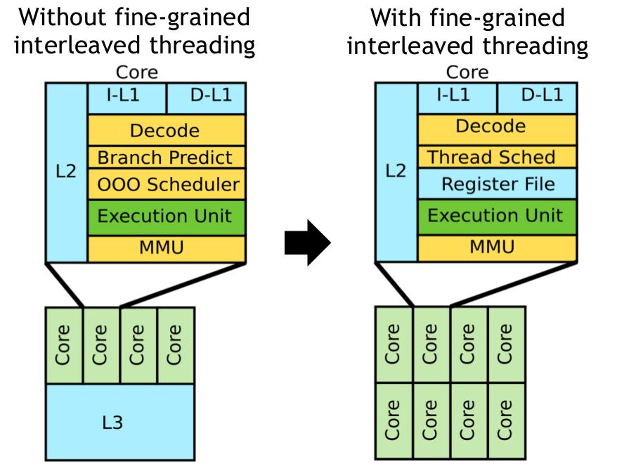
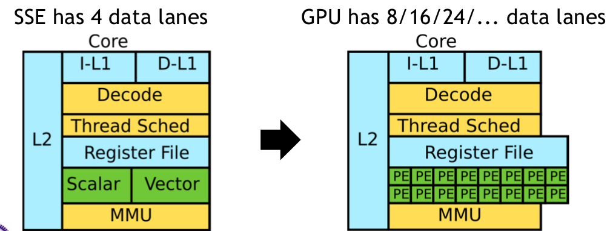
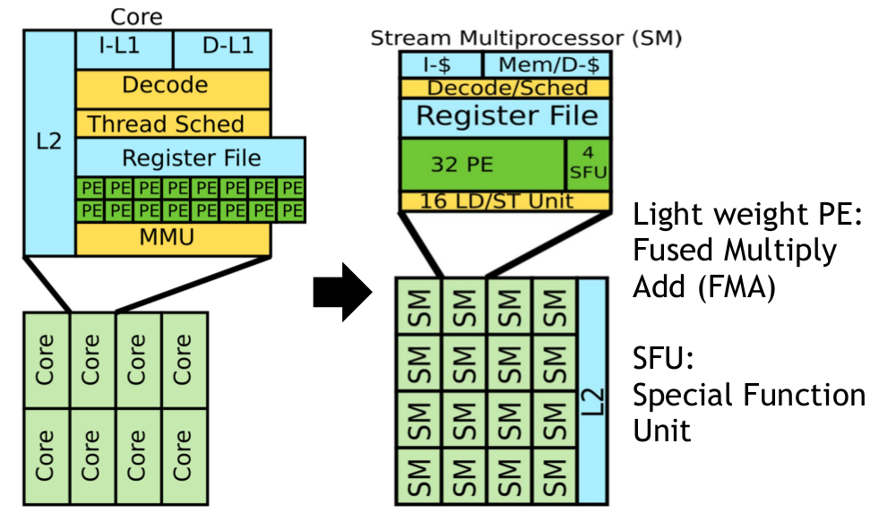
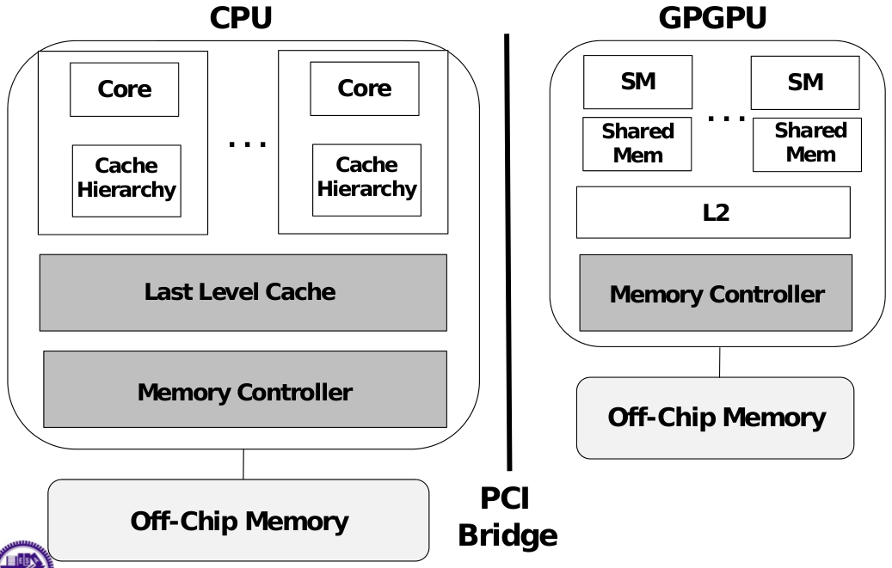
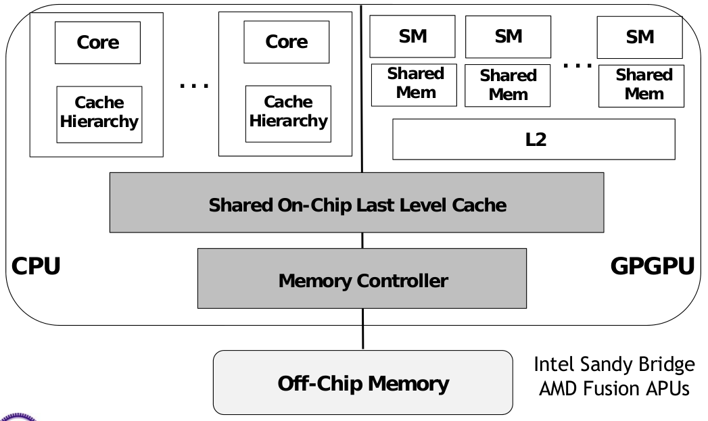
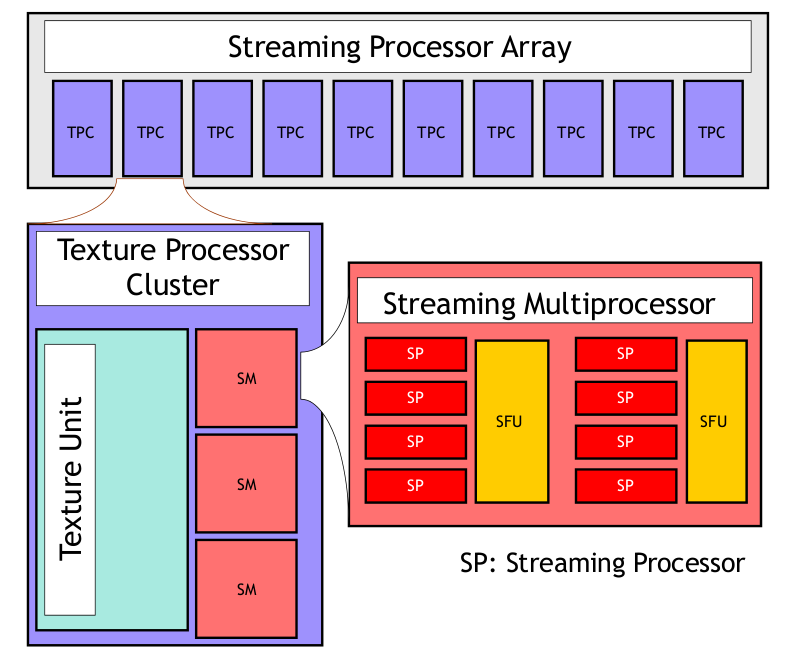

# CUDA

## Table of Content

* [CUDA](#cuda)
  * [Table of Content](#table-of-content)
  * [GPUs as Compute Engines](#gpus-as-compute-engines)
  * [GPU Architectures](#gpu-architectures)
    * [GPU Threading Model](#gpu-threading-model)
    * [Separation of Memory Spaces](#separation-of-memory-spaces)
  * [Introduction to CUDA](#introduction-to-cuda)
    * [Parallel Computing Plaform](#parallel-computing-plaform)
    * [Programming Model](#programming-model)
      * [Built-in Data Types and Functions](#built-in-data-types-and-functions)
      * [Thread Model](#thread-model)
      * [Memory Model](#memory-model)
    * [Case Study: Matrix Multiplication](#case-study-matrix-multiplication)
    * [Thread Synchronization](#thread-synchronization)

## GPUs as Compute Engines

* history
  * 2001/2002: GPGPU filed was born
  * 2007: NVIDIA realeases CUDA (Compute Uniform Device Architecture)
  * 2008: Khronos releases OpenCL specification
* CPUs: latency oriented
  * convert long latency memory accesses to short latency cache accesses
  * branch prediction and data forwarding
  * powerful ALUs
* GPUs: throughput oriented
  * small caches: boost memory throughput
  * no branch prediction and no data forwarding
  * energy efficient ALUs

## GPU Architectures

* the brick wall = memory wall + ILP wall + power wall
  * memory wall: memory slow, multiplies fast
  * ILP wall: diminishing returns on more ILP HW
  * power wall: power expensive, transistors free
* break brick wall
  * trade latency with throughput (TLP: thread level parallelism)
    * interleaved multithreading
      * pros: remove branch predictor, OOO scheduler, large cache
      * cons: register pressure, thread scheduler, require huge parallelism

    
    * register file supports zero overhead context switch between interleaved threads
  * single insturction multiple data (SIMD)
    * wide SIMD: 8/16/24/32/64/... processing elements (PEs)
    * single instruction multiple thread (SIMT)  
    
  * simple core  
    

### GPU Threading Model

* CPU: physical cores
* GPU: amount of data, SIMT

### Separation of Memory Spaces

* use `cudaMemcpy()` and `cudaMalloc()`
* discrete GPUs  

* Integrated CPUs-GPUs  


## Introduction to CUDA

### Parallel Computing Plaform



### Programming Model

* declaration specifiers
  * `__global__`, `__device__`, `__shared__`, `__local__`, `__constant__`
* keywords
  * `threadIdx`, `blockIdx`
* intrinsics
  * `__syncthreads`
* runtime API
* function launch
* three key abstractions
  * a hierarchy of thread groups
  * shared memories
  * barrier synchronization
* kernel is similar to a shader in OpenGL

#### Built-in Data Types and Functions

* functional declarations
  * `__global__`: executed on device, callable from host
    * return void
  * `__device__`: executed on device, callable from device
    * inlined by default
  * `__host__`: executed on host, callable from host
  * global and device functions
    * no recursion (except Fermi)
    * no static variables
    * no malloc()
* vector types
  * char[1-4], uchar[1-4], short[1-4], ushort[1-4]
  * int[1-4], uint[1-4], long[1-4], ulong[1-4]
  * longlong[1-4], ulonglong[1-4]
  * float[1-4], double[1-2]
  * make_\<type name\>
  * access with .x, .y, .z, .w
* math functions (partial)
  * sqrt, rsqrt, exp, log
  * sin, cos, tan, sincos
  * asin, acos, atan2
  * trunc, ceil, floor
* intrinsic function
  * device only, faster, less accurate
  * __exp, __log, __sin, __pow, ...

#### Thread Model

* a kernel -> a grid -> some blocks -> many threads (SPs)
* cooperate between threads exists in the same block
  * synchronize
  * access shared memory
* they can cooperate in newer architecture
* grid: 1D or 2D
* block: 1D, 2D or 3D
* thread ID
  * 1D: thread ID
  * 2D: x + yD<sub>x</sub>
  * 3D: x + yD<sub>x</sub> + zD<sub>x</sub>D<sub>y</sub>
* `<<<numBlocks, threadsPerBlock>>>`
* scheduling threads
  * each thread block is divided in 32-threads warps
    * implementation decision
  * warps are the basic unit in SM
* SM warp scheduling
  * zero-overhead
  * all threads in a warp execute the same instruction

#### Memory Model

### Case Study: Matrix Multiplication

* [cuda1_matmul.cu](cuda1_matmul.cu)
* [cuda2_matmul_blocks.cu](cuda1_matmul_blocks.cu)
  * remove size limitation
  * assign each tile to a block
* [cuda3_matmul_shared.cu](cuda3_matmul_shared.cu)
  * reduce global memory access

### Thread Synchronization

* `__syncthreads()` waits all threads in a block to reach it
* `__device__ int atomicAdd(int *address, int val);`
* `atomicCAS()` pseudo implementation

``` C
int atomicCAS(int *address, int compare, int val) {
  __lock(address) {
    int old = *address;
    *address = (old == compare) ? val : old;
    return old;
  }
}
```

* implement `atomicAdd()` given `atomicCAS()`

``` C
__device__ int atomicAdd(int *address, int val) {
  int old = *address, assumed;
  do {
    assumed = old;
    old = atomicCAS(address, assumed, val + assumed);
  } while (assumed != old);
  return old;
}
```

* more atomic functions
  * atomicAdd(), atomicSub(), atomicExch()
  * atomicMin(), atomicMax(), atomicDec(), atomicCAS()
  * atomicAnd(), atomicOr(), atomicXor()
