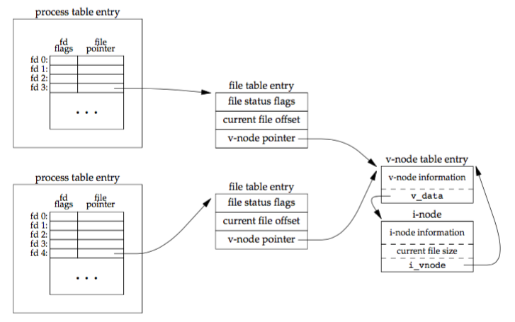
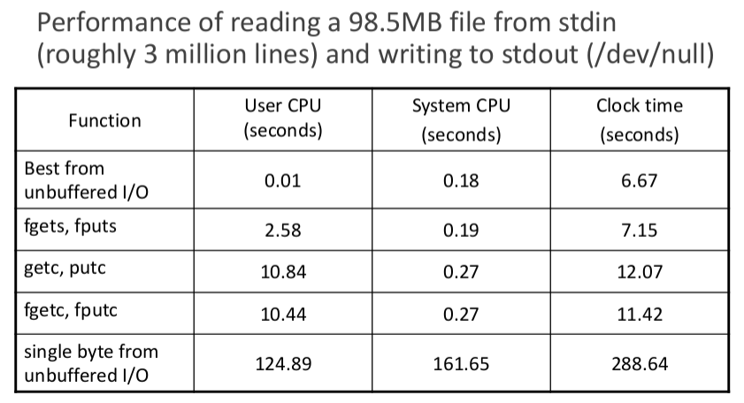

# File I/O and Standard I/O

## Table of Contents

* [File I/O and Standard I/O](#file-io-and-standard-io)
  * [Table of Contents](#table-of-content)
  * [File I/O vs Standard I/O](#file-io-vs-standard-io)
  * [File Descriptors](#file-descriptors)
  * [File I/O Functions](#file-io-functions)
  * [File I/O Other Issues](#file-io-other-issues)
  * [Standard I/O Functions](#standard-io-functions)

## File I/O vs Standard I/O

* File I/O
  * system call, talk to kernel
  * file descriptors
  * unbuffered
  * `open`, `read`, `write`, `lseek`, and `close`
* Standard I/O
  * user level
  * wrapped file descriptors
  * buffered
  * fileno

## File Descriptors

* non-negative integer
  * defined in `unistd.h`
  * `STDIN_FILENO`: 0
  * `STDOUT_FILENO`: 1
  * `STDERR_FILENO`: 2
  * ranged from 0 to `OPEN_MAX` - 1
    * can be changed by `setrlimit(2)`

## File I/O Functions

* `open(2)`: `int open(const char *pathname, int flags, mode_t mode);`
  * return: file descriptor if OK, -1 error
  * mandatory flags
    * `O_RDONLY`
    * `O_WRONLY`
    * `O_RDWR`
  * optional flags
    * `O_APPEND`
    * `O_CREAT`: create if non-exist, otherwise use existing file
    * `O_TRUNC`: truncated file to 0
    * `O_EXCL`: return error if the file exists
      * `O_CREAT | O_EXCL`: atomic `creat`
    * `O_SYNC`
* `creat(2)`: `int creat(const char *pathname, mode_t mode);`
  * return: file descriptor if OK, -1 error
  * equivalent to
  * `open(pathname, O_WRONLY | O_CREAT | O_TRUNC, mode);`
* `close(2)`: `int close(int filedes);`
  * return: 0 OK, -1 error
* `lseek(2)`: `off_t lseek(int fd, off_t offset, int whence);`
  * return: new file offset if OK, -1 error
  * `off_t` is usually 32-bit long
  * `lseek64()` function using `off64_t`
  * `whence`
    * `SEEK_SET`
    * `SEEK_CUR`
    * `SEEK_END`
  * detect capability of seeking
* file hole
  * `lseek` offset exceed file end, `write` data
  * consecutive null characters
  * but dose not occupy file system
* `read(2)`: `ssize_t read(int fd, void *buf, size_t nbytes);`
  * return: number of bytes read, 0 EOF, -1 error
  * file offset moves forward after read
* `write(2)`: `ssize_t write(int fd, const void *buf, size_t nbytes);`
  * return: number of bytes written if OK, -1 error
  * file offset moves forward after write

## File I/O Other Issues

* I/O Efficiency: the larger buffer, the more efficiency to read
* File Sharing
  * each process has an entry in the process table
  * each process table entry contains a table of opened file descriptors
  * a file table for all opened files
  * each file table is associated with a v-node structure
  * share file by `fork`
  
* Atomic Operation
  * `pread(2)`: `ssize_t pread(int fd, void *buf, size_t count, off_t offset);`
    * return: number of bytes read, 0 EOF, -1 error
  * `pwrite(2)`: `ssize_t pwrite(int fd, const void *buf, size_t count, off_t offset);`
    * return: number of bytes written if OK, -1 error
  * seek first then read/write
  * create a non-existing file

    ``` C
    if ((fd = open(pathname, O_WRONLY)) < 0) {
      if (errno == ENOENT) {
        /* probelm happens if process 3 create file and write data */
        if ((fd = creat(pathname, mode)) < 0) {
          printf("creat error\n");
        }
      } else {
        printf("open error\n");
      }
    }
    ```

    * better: `open(pathname, O_CREAT | O_EXCL, mode);`
* Duplicate Function
  * `dup(2)`: `int dup(int oldfd);`
  * `dup2(2)`: `int dup2(int oldfd, int newfd);`
    * atomic operation
  * both return: new file descriptor if OK, -1 error
  * `dup(fd);` = `fcntl(fd, F_DUPFD, 0);`
  * `dup2(fd, fd2);` = `close(fd2); fcntl(fd, F_DUPFD, fd2);`

* `sync`, `fsync`, and `fdatasync` Functions
  * ask kernel to start writing cached disk blocks
  * `sync(2)`: `void sync(void);`
    * all files, filedata + metadata
  * `syncfs(2)`: `int syncfs(int fd);`
  * `fsync(2)`: `int fsync(int fd);`
    * filedata + metadata
  * `fdatasync(2)`: `int fdatasync(int fd);`
    * filedata only
* `fcntl` Function
  * `fcntl(2)`: `int fcntl(int fd, int cmd, ... /* arg */ );`
  * return: depends on `cmd` if OK, -1 error
  * common commands
    * `F_DUPFD`: duplicate the file descriptor
    * `F_GETFD`/`F_SETFD`: get/set the file descriptor flag
      * supports only `FD_CLOEXEC` (close-on-exec)
    * `F_GETFL`/`F_SETFL`: get/set the file status flag
      * `O_RDONLY`, `O_WRONLY`, `O_RDWR`, `O_APPEND`, `O_NONBLOCK`, `O_SYNC`, ...
* `ioctl` Function
  * `ioctl(2)`: `int ioctl(int fd, unsigned long request, ...);`
  * return: -1 error, others if OK
  * handle user-kernel interaction, no standard for this function
  * request is a device dependent request code
  * third argument is usually an untyped pointer to memory
* `/dev/fd`
  * modern systems provide
  * virtual file system
  * each process has its own `/dev/fd`
    * `fd = open("dev/fd/0", mode)`: standard input
  * `tmpnam(3)`, `mkstemp(3)`: show usage below
  * identify network connections

## Standard I/O Functions

* Standard Buffered I/O
  * buffer allocation
  * perform I/O in optimal-sized chunks
* FILE structure
  * treat all opened files as stream
  * associate stream with file descriptor
  * maintain buffer states
* Buffering
  * fully buffered
    * files in disk are normally fully buffered
    * standard I/O functions calls `malloc` the first time it performed on a stream
  * line buffered
    * standard I/O functions performs I/O when `\n` is encountered
    * caveats
      * buffer size is limited: I/O may perform before seeing `\n`
      * before read, all line-buffered output streams are flushed
  * unbuffered
* Default Buffer Modes
  * ISO C
    * stdio are fully buffered if and only if they don't refer to an interactive device
    * stderr is never fully buffered
  * most default implementations
    * stderr is always unbuffered
    * stdio
      * line buffered if they refer to a terminal device
      * otherwise, fully buffered
* Set Buffer Functions
  * `setbuf(3)`: `void setbuf(FILE *fp, char *buf);`
  * `setvbuf(3)`: `int setvbuf(FILE *stream, char *buf, int mode, size_t size);`
  * return: 0 OK, nonzero error
  * buffering is disabled if `buf` is `NULL`
  * mode
    * `_IOFBF`: fully buffered
    * `_IOLBF`: line buffered
    * `_IONBF`: unbuffered
* Open Files
  * `fopen(3)`: `FILE *fopen(const char *pathname, const char *mode);`
  * `freopen(3)`: `FILE *freopen(const char *pathname, const char *mode, FILE *stream);`
  * `fdopen(3)`: `FILE *fdopen(int fd, const char *mode);`
  * return: file pointer OK, `NULL` error
  * mode
    * `r` or `rb`: reading
    * `w` or `wb`: truncate to 0 length or create for writing
    * `a` or `ab`: append, open for writing at EOF or create for writing
    * `r+`, `r+b`, or `rb+`: open for reading and writing
    * `w+`, `w+b`, or `wb+`: `w` or `wb` + reading
    * `a+`, `a+b`, or `ab+`: `a` or `ab` + reading
    * Note: Unix does not require `t` mode for text files
* Read and Write a String - By Character
  * read
    * `getc(3)`: `int getc(FILE *stream);`
    * `fgetc(3)`: `int fgetc(FILE *stream);`
    * `getchar(3)`: `int getchar(void);`
    * return: next character OK, EOF on EOF or error
  * write
    * `putc(3)`: `int putc(int c, FILE *stream);`
    * `fputc(3)`: `int fputc(int c, FILE *stream);`
    * `putchar(3)`: `int putchar(int c);`
    * return: c if OK, EOF error
  * EOF or error
    * `feof(3)`: `int ferror(FILE *stream);`
    * `ferror(3)`: `int feof(FILE *stream);`
    * return: nonzero if true, 0 otherwise
* Read and Write a String - By Line
  * read
    * `fgets(3)`: `char *fgets(char *s, int size, FILE *stream);`
    * `gets(3)`: `char *gets(char *s);`
    * return: `buf` OK, `NULL` on EOF or error
  * write
    * `fputs(3)`: `int fputs(const char *s, FILE *stream);`
    * `puts(3)`: `int puts(const char *s);`
    * return: non-negative value OK, EOF error
* Standard I/O Efficiency
  
* Binary I/O
  * `fread(3)`: `size_t fread(void *ptr, size_t size, size_t nmemb, FILE *stream);`
  * `fwrite(3)`: `size_t fwrite(const void *ptr, size_t size, size_t nmemb, FILE *stream);`
  * return: number of items read or written
  * `nmemb` items of data, each `size` bytes long
* Positioning a Stream
  * `fseek(3)`: `int fseek(FILE *stream, long offset, int whence);`
  * `ftell(3)`: `long ftell(FILE *stream);`
  * `rewind(3)`: `void rewind(FILE *stream);`
* Temporary Files
  * `tmpnam(3)`: `char *tmpnam(char *s);`
    * return: pointer to unique pathname
    * not recommend to use
      * it use static buffer to store generated filenames
      * name is usually `/tmp/fileXXXXXX`, might be guessed
    * use `tmpfile(3)` or `mkstemp(3)` instead
      * `fileno(3)` on file pointer to get file descriptor
      * `readlink(2)` on `/proc/self/fd/XXX` to get filename
      * then open(2) with `O_EXCL` flag
  * `tmpfile(3)`: `FILE *tmpfile(void);`
    * return: file pointer OK, `NULL` error
  * `mkstemp(3)`: `int mkstemp(char *template);`
    * last six characters of `template` must be `XXXXXX`
    * return: file descriptor if OK, -1 error
  * `fileno(3)`: `int fileno(FILE *stream);`
