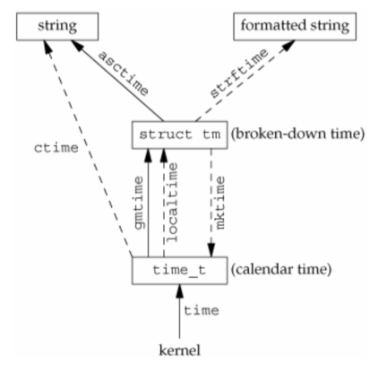

# System Data Files and Information

## Table of Contents

* [System Data Files and Information](#system-data-files-and-information)
  * [Table of Contents](#table-of-contents)
  * [Overview](#overview)
  * [Password](#password)
  * [Group](#group)
  * [Other Data Files](#other-data-files)
  * [Accounting](#accounting)
  * [System Identification](#system-identification)
  * [Time and Date Routines](#time-and-date-routines)

## Overview

* password file: `/etc/passwd`
* group file: `/etc/group`
* many other system configuration files: `/etc`
* portable interfaces to these files are provided
* who am I: `id` command

## Password

* `/etc/passwd` file
  | Description                  | struct passwd member | POSIX.1 | FreeBSD 8.0 | Linux 3.2 | Mac OS X 10.6.8 | Solaris 10 |
  | :--------------------------- | :------------------- | :-----: | :---------: | :-------: | :-------------: | :--------: |
  | User name                    | `char *pw_name`      |    •    |      •      |     •     |        •        |     •      |
  | Encrypted password           | `char *pw_passwd`    |         |      •      |     •     |        •        |     •      |
  | Numerical user ID            | `uid_t pw_uid`       |    •    |      •      |     •     |        •        |     •      |
  | Numerical group ID           | `gid_t pw_gid`       |    •    |      •      |     •     |        •        |     •      |
  | Comment field                | `char *pw_gecos`     |         |      •      |     •     |        •        |     •      |
  | Initial working dir          | `char *pw_dir`       |    •    |      •      |     •     |        •        |     •      |
  | Initial shell                | `char *pw_shell`     |    •    |      •      |     •     |        •        |     •      |
  | User access class            | `char *pw_class`     |         |      •      |           |        •        |            |
  | Next time to change password | `time_t pw_change`   |         |      •      |           |        •        |            |
  | Account expiration time      | `time_t pw_expire`   |         |      •      |           |        •        |            |
  * initial shell is the first process that a user logs in
    * use `/dev/null` or `/bin/false` to prevent users from logging in
    * valid shells are listed in `/etc/shells`
  * use command `finger` to read information of this file
* functions
  * include `<pwd.h>`
  * get `struct passwd` for a specific user
    * `struct passwd *getpwuid(uit_t uid);`
    * `struct passwd *getpwnam(const char *name);`
  * iteratively retrieve all password information
    * `struct passwd *getpwent(void);`
    * `void setpwent(void);` -> rewind
    * `void endpwent(void);` -> close file
* modern UNIX systems move the encrypted password into another file
  * instead of `/etc/passwd` in the past
  * FreeBSD: `/etc/master.passwd`
  * Linux: `/etc/shadow`
* Linux's Shadow Structure
  * include `<shadow.h>`
  * `struct spwd *getspnam(const char *name);`
  * `struct spwd *getspent(void);`
  * `void setspent(void);`
  * `void endspent(void);`

  | Decription                                                  | struct spwd member |
  | :---------------------------------------------------------- | :----------------- |
  | User login name                                             | `char *sp_nmap`    |
  | Encrypted password                                          | `char *sp_pwdp`    |
  | Date of last password change (days since epoch)             | `long sp_lastchg`  |
  | Min # of days between changes                               | `long sp_min`      |
  | Max # of days between changes                               | `long sp_max`      |
  | # of days before password expires to warn user to change it | `long sp_warn`     |
  | # of days after password expires until account is disabled  | `long sp_inact`    |
  | Date when account expires (days since epoch)                | `long sp_expire`   |
  | Reserved                                                    | `long sp_flag`     |
* More on User Passwords
  * Algorithm id + Salt + Encrypted password
  * `crypt(3)` function
    * include `<crypt.h>`, link with `-lcrypt`
    * `char *crypt (const char *key, const char *salt)`
    * e.g.
      * `crypt("password", "abcde")`
      * `crypt("password", "$5$abcde$")`

## Group

* `/etc/group` file
  | Description                                | struct group member | POSIX.1 | FreeBSD 8.0 | Linux 3.2 | Mac OS X 10.6.8 | Solaris 10 |
  | :----------------------------------------- | :------------------ | :-----: | :---------: | :-------: | :-------------: | :--------: |
  | Group name                                 | `char *gr_name`     |    •    |      •      |     •     |        •        |     •      |
  | Encrypted password                         | `char *gr_passwd`   |         |      •      |     •     |        •        |     •      |
  | Numerical group ID                         | `gid_t gr_gid`      |    •    |      •      |     •     |        •        |     •      |
  | Array of pointers to individual user names | `char **gr_mem`     |    •    |      •      |     •     |        •        |     •      |
* Supplement Group IDs
  * in the past, a UNIX user is belong to a single group
  * user is also belong to a number of additional groups
  * command `newgrp(1)` to switch between allowed groups
    * change current effective GID
  * permission check are performed based on all the group IDs
  * the number of additional groups has a limit `NGROUPS_MAX`, usually 16
* functions
  * include `<grp.h>`
  * get `struct group` for a specific group
    * `struct group *getgrgid(gid_t gid);`
    * `struct group *getgrnam(const char *name);`
  * iteratively retrieve all group information
    * `struct group *getgrent(void);`
    * `void setgrent(void);` -> rewind
    * `void endgrent(void);` -> close file
  * `initgroups(3)`: `int initgroups(const char *username, gid_t basegid);`
    * setup gid and supplement groups IDs for a user based on `/etc/group`
  * `setgroups(2)`: `int setgroups(int ngroups, const gid_t grouplist[]);`
    * setup supplement group IDs, usually called by `initgroups(3)`
  * `getgroups(2)`: `int getgroups(int gidsetsize, gid_t grouplist[]);`
    * in `<unistd.h>`
* Implementation Differences
  |      Information       |     FreeBSD 8.0      |  Linux 3.2.0  |   Mac OS 10.6.8    |  Solaris 10   |
  | :--------------------: | :------------------: | :-----------: | :----------------: | :-----------: |
  |  Account information   |    `/etc/passwd`     | `/etc/passwd` | Directory Services | `/etc/passwd` |
  |  Encrypted passwords   | `/etc/master.passwd` | `/etc/shadow` | Directory Services | `/etc/shadow` |
  | Hashed password files? |         yes          |      no       |         no         |      no       |
  |   Group information    |     `/etc/group`     | `/etc/group`  | Directory Services | `/etc/group`  |
  * some UNIX systems implement user and group database by
    * network information service (NIS)
    * lightweight directory access protocol (LDAP)
    * have a look at `/etc/nsswitch.conf`

## Other Data Files

| Description |   Data file    |    Header    | Structure  | Lookup function                      |
| :---------: | :------------: | :----------: | :--------: | :----------------------------------- |
|  password   |  /etc/passwd   |  `<pwd.h>`   |  `passwd`  | `getpwnam`, `getpwuid`               |
|   groups    |  /etc/groups   |  `<grp.h>`   |  `group`   | `getgrnam`, `getgrgid`               |
|   shadow    |  /etc/shadow   | `<shadow.h>` |   `shwd`   | `getspnam`                           |
|    hosts    |   /etc/hosts   | `<netdb.h>`  | `hostent`  | `gethostbyname`, `gethostbyaddr`     |
|  networks   | /etc/networks  | `<netdb.h>`  |  `netent`  | `getnetbyname`, `getnetbyaddr`       |
|  protocols  | /etc/protocols | `<netdb.h>`  | `protornt` | `getprotobynabe`, `getprotobynumber` |
|  services   | /etc/services  | `<netdb.h>`  | `servent`  | `getservbyname`, `getservbyport`     |

## Accounting

* `utmp(5)`: record the currently logged in users

  ``` C
  struct utmp {
    short   ut_type;              /* Type of record */
    pid_t   ut_pid;               /* PID of login process */
    char    ut_line[UT_LINESIZE]; /* Device name of tty - "/dev/" */
    char    ut_id[4];             /* Terminal name suffix, or inittab(5) ID */
    char    ut_user[UT_NAMESIZE]; /* Username */
    char    ut_host[UT_HOSTSIZE]; /* Hostname for remote login,
                                     or kernel version for run-level messages */
    ...
  }
  ```

* `wtmp(5)`: record the history of user login, logout, and system (up, down, or reboot) activities
* relevant commands
  * `w(1)`
  * `who(1)`
  * `last(1)`

## System Identification

* `uname(2)`: `int uname(struct utsname *buf);`
  * return: 0 OK, -1 error

  ``` C
  struct utsname {
    char sysname[];    /* Operating system name (e.g., "Linux") */
    char nodename[];   /* Name within "some implementation-defined network" */
    char release[];    /* Operating system release (e.g., "2.6.28") */
    char version[];    /* Operating system version */
    char machine[];    /* Hardware identifier */
  };
  ```

* `uname(1)`

  ``` bash
  $ uanme -a
  Linux ee904-itri-pc2 4.15.0-50-generic #54-Ubuntu SMP Mon May 6 18:46:08 UTC 2019 x86_64 x86_64 x86_64 GNU/Linux
  ```

  | Field             | Description                                  |
  | :---------------- | :------------------------------------------- |
  | System            | `Linux`                                      |
  | Node              | `ee904-itri-pc2`                             |
  | Release           | `4.15.0-50-generic`                          |
  | Version           | `#54-Ubuntu SMP Mon May 6 18:46:08 UTC 2019` |
  | Machine           | `x86_64`                                     |
  | Processor         | `x86_64`                                     |
  | Hardware platform | `x86_64`                                     |
  | Operating system  | `GNU/Linux`                                  |

## Time and Date Routines

* `time(2)`: `time_t time(time_t *tloc);`
  * return: current time from epoch (seconds)
  * if `tloc` is not `NULL`, `tloc` will also point to the current time
* `gettimeofday(2)`: `int gettimeofday(struct timeval *tv, struct timezone *tz);`
  * return: 0 OK, -1 error
  * `tv` point to current time from epoch (microseconds)
  * `tz` is usually `NULL`, see NOTES in man page

  ``` C
  struct timeval {
    time_t      tv_sec;     /* seconds */
    suseconds_t tv_usec;    /* microseconds */
  };

  struct timezone {
    int tz_minuteswest;     /* minutes west of Greenwich */
    int tz_dsttime;         /* type of DST correction */
  };
  ```

* Time Functions
  * relationships
    * solid arrow: UTC time zone
    * dashed arrow: time zone base on environment variable `TZ`

    
  * structure `tm`

    ``` C
    struct tm {
      int tm_sec;    /* Seconds (0-60) */
      int tm_min;    /* Minutes (0-59) */
      int tm_hour;   /* Hours (0-23) */
      int tm_mday;   /* Day of the month (1-31) */
      int tm_mon;    /* Month (0-11) */
      int tm_year;   /* Year - 1900 */
      int tm_wday;   /* Day of the week (0-6, Sunday = 0) */
      int tm_yday;   /* Day in the year (0-365, 1 Jan = 0) */
      int tm_isdst;  /* Daylight saving time */
    };
    ```

  * break down `time_t` value
    * `gmtime(3)`
      * `struct tm *gmtime(const time_t *timep);`
      * `struct tm *gmtime_r(const time_t *timep, struct tm *result);`
    * `localtime(3)`
      * `struct tm *localtime(const time_t *timep);`
      * `struct tm *localtime_r(const time_t *timep, struct tm *result);`
  * print out time in a string
    * `asctime(3)`
      * `char *asctime(const struct tm *tm);`
      * `char *asctime_r(const struct tm *tm, char *buf);`
    * `ctime(3)`
      * `char *ctime(const time_t *timep);`
      * `char *ctime_r(const time_t *timep, char *buf);`
  * make up `time_t` value
    * `mktime(3)`: `time_t mktime(struct tm *tm);`
  * formatted output
    * `strftime(3)`: `size_t strftime(char *s, size_t max, const char *format, const struct tm *tm);`

    | Format | Description                   | Example                  |
    | :----: | :---------------------------- | :----------------------- |
    |  `%a`  | Abbr. weekday name            | Mon                      |
    |  `%A`  | Full weekday name             | Monday                   |
    |  `%b`  | Abbr. month name              | May                      |
    |  `%B`  | Full month name               | May                      |
    |  `%c`  | Date and time                 | Mon May 27 13:25:57 2019 |
    |  `%C`  | Year/100                      | 20                       |
    |  `%d`  | Day of month, leading zero    | 27                       |
    |  `%D`  | Date \[MM/DD/YY\]             | 05/27/19                 |
    |  `%e`  | Day of month, leading space.  | 27                       |
    |  `%F`  | ISO 8601: `%Y`-`%m`-`%d`      | 2019-05-27               |
    |  `%g`  | `%G` without century          | 19                       |
    |  `%G`  | ISO 8601 week-based year      | 2019                     |
    |  `%h`  | same as `%b`                  | May                      |
    |  `%H`  | Hour (24-hours)               | 13                       |
    |  `%I`  | Hour (12-hours)               | 01                       |
    |  `%j`  | Day of the year: 001-366      | 147                      |
    |  `%m`  | Month: 01-12                  | 05                       |
    |  `%M`  | Minute: 00-59                 | 37                       |
    |  `%n`  | New line                      |                          |
    |  `%p`  | AM or PM                      | PM                       |
    |  `%r`  | Locale's time (12-hours)      | 13:37:13 PM              |
    |  `%R`  | `%H:%M`                       | 13:37                    |
    |  `%S`  | Second: 00-60                 | 13                       |
    |  `%t`  | Horizontal tab                |                          |
    |  `%T`  | `%H:%M:%S`                    | 13:37:13                 |
    |  `%u`  | ISO 8601 weekday: 1-7         | 1                        |
    |  `%U`  | Sunday week number: 00-53     | 21                       |
    |  `%V`  | ISO 8601 week number          | 22                       |
    |  `%w`  | Sunday weekay: 0-6            | 1                        |
    |  `%W`  | Monday week number: 00-53     | 21                       |
    |  `%x`  | Date                          | 05/27/19                 |
    |  `%X`  | Time                          | 13:37:13                 |
    |  `%y`  | Year without century          | 19                       |
    |  `%Y`  | Year                          | 2019                     |
    |  `%z`  | Offset from UTC               | +0800                    |
    |  `%Z`  | Timezone name or abbreviation | CST                      |
    |  `%%`  | '%' character                 | %                        |
  * Example
  
    ``` C
    int main() {
      time_t t = time(0);
      struct tm tm1, tm2;
      char buf[256];
      gmtime_r(&t, &tm1);
      localtime_r(&t, &tm2);
      printf("         time: %ld\n", t);
      printf("         cime: %s", ctime_r(&t, buf));
      printf(" g -> asctime: %s", asctime(&tm1));
      printf(" l -> asctime: %s", asctime(&tm2));
      strftime(buf, sizeof(buf), "%c %Z (%z)", &tm1);
      printf("g -> strftime: %s\n", buf);
      strftime(buf, sizeof(buf), "%c %Z (%z)", &tm2);
      printf("l -> strftime: %s\n", buf);
    }

    /* Result:
     *          time: 1558936577
     *          cime: Mon May 27 13:56:17 2019
     *  g -> asctime: Mon May 27 05:56:17 2019
     *  l -> asctime: Mon May 27 13:56:17 2019
     * g -> strftime: Mon May 27 05:56:17 2019 GMT (+0000)
     * l -> strftime: Mon May 27 13:56:17 2019 CST (+0800)
     */
    ```

* Time Zone
  * `tzset(3)`
  * standard: `std offset`
    * offset
      * `[+|-]hh[:mm[:ss]]`
      * positive: west of the Prime Meridian
      * negative: east of the Prime Meridian
    * e.g.
      * `CST-08:00:00`
      * `PST08:00:00`
      * `NSDT-13:00:00`
  * daylight saving time: `std offset dst[offset][,start[/time],end[/time]]`
    * e.g.
      * `NZST-12:00:00NZDT-13:00:00,M10.1.0,M3.3.0`
  * predefined: files stored in `/usr/share/zoneinfo`
    * `:filename`
    * e.g.
      * `:Asia/Taipei`
      * `:America/Vancouver`
      * `:NZ`
