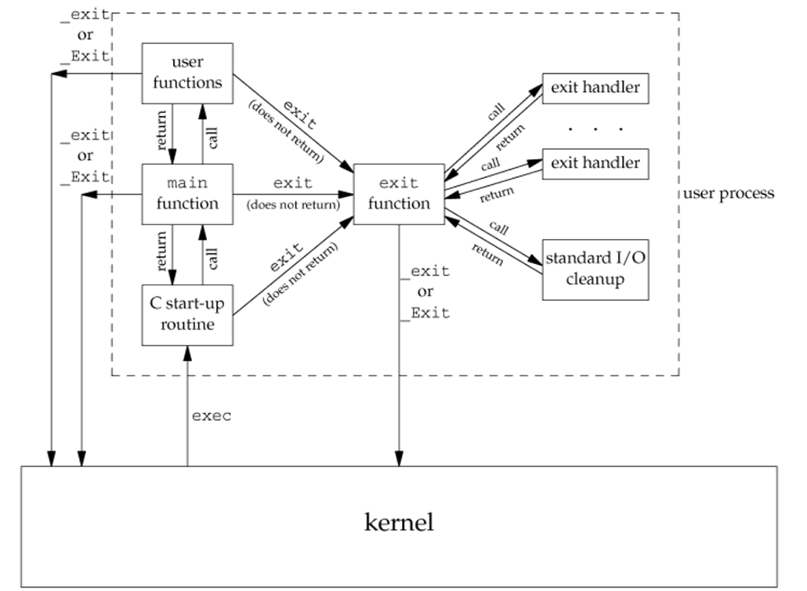
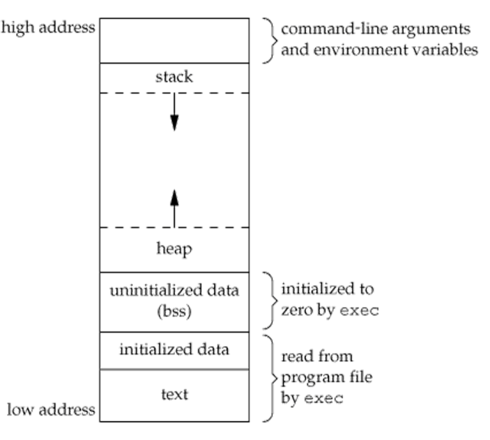

# Process Environment

## Table of Contents

* [Process Environment](#process-environment)
  * [Table of Contents](#table-of-content)
  * [Process Start and Termination](#process-start-and-termination)
  * [Environment Variables](#environment-variables)
  * [Memory Layout](#memory-layout)
  * [Shared Libraries](#shared-libraries)
  * [Memory Allocation](#memory-allocation)
  * [setjmp and longjmp](#setjmp-and-longjmp)
  * [Restoration of Variables](#restoration-of-variables)
  * [Process resource limits](#process-resource-limits)

## Process Start and Termination

* Process Start
  * `int main(int argc, char *argv[]);`
  * `int main(int argc, char *argv[], char *envp);`
* Five Normal Terminations
  * return from `main`
  * call `exit`
  * call `_exit` or `_Exit`
  * return of the last thread from its start routine
  * call `pthread_exit` from the last thread
* Three Abnormal Terminations
  * call `abort`
  * receipt of a signal
  * response of the last thread to a cancellation request
* Execution of a main function
  * `exit(main(argc, argv));`
* Manual Cleanups on Exit
  * `int atexit(void (*function)(void));`
  * register up to 32 customized functions
    * linux has extended the restriction
* Exit functions
  * `exit`
    * call `atexit` registered functions
    * clean shutdown of standard I/O library
    * `fclose()` all stream, remove `tmpfile()`
  * `_exit` and `_Exit`
    * terminate immediately
* Start and Terminaation of a C Program


## Environment Variables

* List of Environment Variable Functions
  * `char *getenv(const char *name);`
  * `int putenv(char *string);`
  * `int setenv(const char *name, const char *value, int overwrite);`
  * `int unsetenv(const char *name);`
  * `int clearenv(void);`

  | Function | ISO C | POSIX.1 | FreeBSD 8.0 | Linux 3.2.0 | Mac OS X 10.6.8 | Solaris 10 |
  | :------: | :---: | :-----: | :---------: | :---------: | :-------------: | :--------: |
  |  getenv  |   •   |    •    |      •      |      •      |        •        |     •      |
  |  putenv  |       |   XSI   |      •      |      •      |        •        |     •      |
  |  setenv  |       |    •    |      •      |      •      |        •        |            |
  | unsetenv |       |    •    |      •      |      •      |        •        |            |
  | clearenv |       |         |             |      •      |                 |            |
* Access Environment List
  * entry after last `char *` element is `NULL`
  * `int main(int argc, char *argv[], char *envp[]);`
  * `extern char **environ`
* Environment List Operations
  * delete entry
    * free a string and move all subsequent pointers down one
  * modify entry
    * new_size <= old_size, overwrite the old one
    * new_size > old_size, allocate new space
  * add entry
    * 1st time, allocate a new space
    * non-1st time, reallocate a larger space
* Common Environment Variables
  |   Variable    | POSIX.1 | FreeBSD 8.0 | Linux 3.2.0 | Mac OS X 10.6.8 | Solaris 10 | Description                                         |
  | :-----------: | :-----: | :---------: | :---------: | :-------------: | :--------: | :-------------------------------------------------- |
  |   `COLUMNS`   |    •    |      •      |      •      |        •        |     •      | Terminal Width                                      |
  |  `DATEMASK`   |   XSI   |             |      •      |        •        |     •      | getdate(3) template file pathname                   |
  |    `HOME`     |    •    |      •      |      •      |        •        |     •      | Home directory                                      |
  |    `LANG`     |    •    |      •      |      •      |        •        |     •      | Name of locale                                      |
  |   `LC_ALL`    |    •    |      •      |      •      |        •        |     •      | Name of locale                                      |
  | `LC_COLLATE`  |    •    |      •      |      •      |        •        |     •      | Name of locale for collation                        |
  |  `LC_CTYPE`   |    •    |      •      |      •      |        •        |     •      | Name of locale for character classification         |
  | `LC_MESSAGES` |    •    |      •      |      •      |        •        |     •      | Name of locale for messages                         |
  | `LC_MONETARY` |    •    |      •      |      •      |        •        |     •      | Name of locale for monetary editing                 |
  | `LC_NUMERIC`  |    •    |      •      |      •      |        •        |     •      | Name of locale for numeric editing                  |
  |   `LC_TIME`   |    •    |      •      |      •      |        •        |     •      | Name of locale for date/time formatting             |
  |    `LINES`    |    •    |      •      |      •      |        •        |     •      | Terminal height                                     |
  |   `LOGNAME`   |    •    |      •      |      •      |        •        |     •      | Login name                                          |
  |   `MSGVERB`   |   XSI   |      •      |      •      |        •        |     •      | fmtmsg(3) message components to process             |
  |   `NLSPATH`   |    •    |      •      |      •      |        •        |     •      | Sequence of templates for message catalogs          |
  |    `PATH`     |    •    |      •      |      •      |        •        |     •      | List of path prefixes to search for executable file |
  |     `PWD`     |    •    |      •      |      •      |        •        |     •      | Absolute pathname of current working directory      |
  |    `SHELL`    |    •    |      •      |      •      |        •        |     •      | Name of user's preferred shell                      |
  |    `TERM`     |    •    |      •      |      •      |        •        |     •      | Terminal type                                       |
  |   `TMPDIR`    |    •    |      •      |      •      |        •        |     •      | Pathname of directory for creating temporary files  |
  |     `TZ`      |    •    |      •      |      •      |        •        |     •      | Time zone information                               |

## Memory Layout

* stack: local variable, function call states
* heap: dynamic allocated memory
* bss: uninitialized static or global variables
* data: initialized static or global variables
  * read-only, read-write
* text: machine instructions
  * read-only
* use `size(1)` to read sizes of an executable binary



## Shared Libraries

* Maintain Common Libary Routine in Memory
  * reduce the size and memory requirement of executable file\
  * may add runtime overhead
  * library can be replaced with new versions without relink program
    * it is also a security flaw
* Compile Static Program
  * add `-static` flag
* **Library Injection**
  * use `LD_PRELOAD` environment variable
  * usage: `LD_PRELOAD=/path/to/the/injected-shared-object {program}`
  * not work with SUID/SGID executables
  * example
    * `add.h`

      ``` H
      int add(int a, int b);
      ```

    * `add.c`

      ``` C
      #include "add.h"
      int add(int a, int b) {
        return a + b;
      }
      ```

    * `inject.c`

      ``` C
      #include "add.h"
      int add(int a, int b) {
        return a + b + 1;
      }
      ```

    * `main.c`

      ``` C
      #include <stdio.h>
      #include "add.h"
      int main() {
        printf("%d\n", add(1, 2));
      }
      ```

    * build libaray
      * `gcc add.c -fPIC -shared -o add.so`
      * `gcc inject.c -fPIC -shared -o inject.so`
    * build main
      * `gcc main.c -L. -ladd -o main`
    * check main dependency
      * `ldd main`
    * add library path environment variable
      * `export LD_LIBRARY_PATH=/path/to/add.so`
    * run main
      * `./main`
      * `LD_PRELOAD=./inject.so ./main`
* Get Original Function
  * include `<dlfcn.h>`, link option `-ldl`
  * `void *dlopen(const char *filename, int flag);`
  * `char *dlerror(void);`
  * `void *dlsym(void *handle, const char *symbol);`
  * `int dlclose(void *handle);`
  * `dlopen` open library, `dlsym` get function pointer
* Determine Library Injection Possibility
  * No SUID/SGID enabled
  * Not a statically linked binary
    * `file` command
    * `ldd` command
    * `nm` command
      * check the symbol is known or not
        * `U`: unknown
        * `W`: known but weak
        * `T`: in text section
      * `c++filt` demangle c++ symbol

## Memory Allocation

* `void *malloc(size_t size);`
  * allocate `size` bytes memory
  * initial value is indeterminate
* `void *calloc(size_t nobj, size_t size);`
  * allocate `nobj` of objects with each size `size`
  * initial all bits to 0
* `void *realloc(void *ptr, size_t newsize);`
  * increase or decrease the size of `ptr` to `newsize`
  * may move previous allocated area
  * initial value of increase memory is indeterminate
* `void free(void *ptr)` to release memory
* allocation routines are usually implemented with `sbrk(2)`
  * this system call expands (or contracts) the heap of the process
  * but most versions of `malloc` and `free` never decrease their memory size
  * the freed space is available for later allocation
  * the freed space is usually kept in the malloc pool, not return to the kernel
* **the alloca function**
  * include `<alloca.h>`
  * `void *alloca(size_t size);`
  * allocate memories in `stack frames` of the current function call
  * no need to `free`, because it is released automatically after the function returns
  * pros:
    * might be faster than `malloc`
    * no need to free
    * easier to work with `setjmp`/`longjmp`
  * cons:
    * portability

## setjmp and longjmp

* `goto` can be used in the same function
* `setjmp`/`longjmp` are used to go to other functions
* `int setjmp(jmp_buf env);`
  * return: 0 called directly, nonzero (`val`) called from `longjmp`
  * `env` should be global variable: accessed by `setjmp` and `longjmp`
* `void longjmp(jmp_buf env, int val);`
  * if `val` is 0, then it will be replaced by 1

## Restoration of Variables

* types
  * automatic: `auto int autoVal`, default
  * register: `register int regVal`, store in register if possible
  * volatile: `volatile int volVal`, store in memory
* roll back: restore variable value to where initial `setjmp` calls
  * auto type: depends on compiler
    * e.g.
      * gcc with optimize -> roll back
      * gcc with `-O0` -> not roll back
  * register type: roll back
  * volatile type: not roll back
* Rules for Variable Restoration
  * variables stored in memory will have values as of the time of calling `longjmp`
  * variables in the CPU and floating-point registers are restored when calling `setjmp`

## Process resource limits

* every process has a set of resource limits
* initialized by a parent process and inherited by its child processes

``` C
#include <sys/time.h>
#include <sys/resource.h>
int getrlimit(int resource, struct rlimit *rlim);
int setrlimit(int resource, const struct rlimit *rlim);
struct rlimit {
  rlim_t rlim_cur;  /* Soft Limit */
  rlim_t rlim_max;  /* Hard limit (ceiling for rlim_cur) */
};
```

* Partial List of Process Resources

| Limit          |  XSI  | FreeBSD 8.0 | Linux 3.2.0 | Mac OS X 10.6.8 | Solaris 10 | Description (partial)                                               |
| :------------- | :---: | :---------: | :---------: | :-------------: | :--------: | :------------------------------------------------------------------ |
| RLIMIT_AS      |   •   |      •      |      •      |                 |     •      |                                                                     |
| RLIMIT_CORE    |   •   |      •      |      •      |        •        |     •      | max size in bytes of a core file                                    |
| RLIMIT_CPU     |   •   |      •      |      •      |        •        |     •      |                                                                     |
| RLIMIT_DATA    |   •   |      •      |      •      |        •        |     •      |                                                                     |
| RLIMIT_FSIZE   |   •   |      •      |      •      |        •        |     •      |                                                                     |
| RLIMIT_MEMLOCK |       |      •      |      •      |        •        |            | max amount of memory in bytes that a process can lock by `mlock(2)` |
| RLIMIT_NOFILE  |   •   |      •      |      •      |        •        |     •      | max number of open files per process                                |
| RLIMIT_NPROC   |       |      •      |      •      |        •        |            | max number of child processes per real user ID                      |
| RLIMIT_RSS     |       |      •      |      •      |        •        |            |                                                                     |
| RLIMIT_SBSIZE  |       |      •      |             |                 |            |                                                                     |
| RLIMIT_STACK   |   •   |      •      |      •      |        •        |     •      | max size of stack in bytes                                          |
| RLIMIT_VMEM    |       |             |             |                 |     •      |                                                                     |
