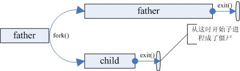
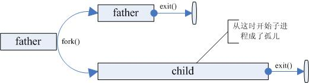
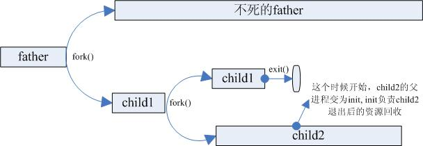
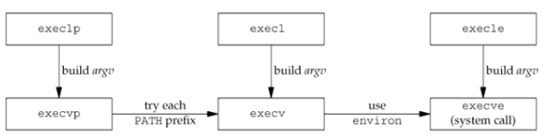

# Process Control

## Table of Contents

* [Process Control](#process-control)
  * [Table of Contents](#table-of-contents)
  * [Overview](#overview)
  * [Process Creation](#process-creation)
  * [Process Termination](#process-termination)
  * [Process Execution](#process-execution)

## Overview

* Process Identifiers
  * init program (`/sbin/init`)
    * `/etc/inittab`
    * `/etc/rc*`
    * `/etc/events.d`
    * never dies
    * parent of all orphaned process
* List of Running Processes
  * `ps`
    * `a`: all with tty, including other users
    * `u`: user-oriented format
    * `x`: processes without controlling ttys
  * `top`
  * `htop`
* Process Relationship: `pstree`
* Retrieve Process Identifiers
  * `pid_t getpid(void);`
  * `pid_t getppid(void);`
  * `uid_t getuid(void);`
  * `uid_t geteuid(void);`
  * `gid_t getgid(void);`
  * `gid_t getegid(void);`
  * no error return

## Process Creation

* The Fork Function
  * `pid_t fork(void);`
    * return: 0 in child, PID of child in parent, -1 error
  * the child is a copy of the parent
    * copy of data space, heap, and stack
    * share the text segment
    * fork, then exec -> copy-on-write (COW)
* Handling File Descriptors After Fork
  * The parent waits for the child to complete
    * The parent does not need to do anything with its descriptors
    * Any of the shared descriptors that the child reads from or writes to have their file offsets updated accordingly
  * Both the parent and the child go their own ways
    * After the fork, the parent closes the descriptors that it doesn't need
    * The child does the same thing
    * This scenario is often the case with network servers
* Other Properties Inherited by the Child
  * real UID, real GIP, EUID, EGID, SUID, SGID
  * supplementary GIDs
  * controlling terminal
  * current working directory
  * file mode creation mask
  * signal mask and dispositions
  * **close-on-exec flag for and open file descriptors**
  * environment variables
* Uses of Fork
  * network servers
  * shells
* Variants of Fork
  * `vfork`
    * without copy the address space of the parent into the child
    * usually used when child calls `exec` or `exit`
    * runs in the address space of the parent until `exec` or `exit`
    * more efficient than use `fork`
  * `clone`
    * allow the caller to control what is shared between parent and child

## Process Termination

* Child Process Termination
  * zombie process
    * parent doesn't read exit status of child
    * resources are freed
    * but PID and termination state are kept in kernel  
      
  * orphan process
    * parent is terminated before its child
    * reparenting by init, therefore PPID is 1  
      
  * parent receives `SIGCHLD` when its child terminates
    * termination is an asynchronous event
    * signal is asynchronous from kernel to parent
    * parent can use signal handler function
* `wait` and `waitpid` function
  * behavior
    * block, if all children are running
    * return termination status, if child terminates and waits for its status to be fetched
    * return an error, if it doesn't have any child processes
  * `pid_t wait(int *status);`
  * `pid_t waitpid(pid_t pid, int *status, int options);`
  * difference between them
    * `wait` always block the caller until a child process terminates
    * `waitpid` has an option that control which process it waits for
    * `waitpid` has an option that prevents it from being blocked
* Macros to Interpret Exit Status
  | Marco                   | Description                                                                                         |
  | :---------------------- | :-------------------------------------------------------------------------------------------------- |
  | `WIFEXITED(status)`     | True if child terminates normally, i.e. `exit(3)`, `_exit(2)`, `_Exit(2)` or return from `main()`   |
  | `WEXITSTATUS(status)`   | Fetch LS 8 bits of return value, used only if `WIFEXITED(status)` returns true                      |
  | `WIFSIGNALED(status)`   | True if child terminates abnormally by receiving a signal                                           |
  | `WTERMSIG(status)`      | Fetch the signal number, used only if `WIFSIGNALED (status)` returns true                           |
  | `WCOREDUMP(status)`     | True if a core file was generated, not a specified in POSIX.1-2001 (some UNIX OS may not implement) |
  | `WIFSTOPPED(status)`    | True if the child was stopped by delivery of a signal                                               |
  | `WSTOPSIG(status)`      | Fetch the signal number, used only if `WIFSTOPPED (status)` returns true                            |
  | `WIFCONTINUED (status)` | True if child was resumed by delivery of `SIGCONT`                                                  |
  * example

    ``` C
    void pr_exit(int status) {
      if (WIFEXITED(status)) {
        printf("normal termination, exit status = %d\n", WEXITSTATUS(status));
      } else if (WIFSIGNALED(status)) {
        printf("abnormal termination, signal number = %d\n", WTERMSIG(status));
      } else if (WIFSTOPPED(status)) {
        printf("child stopped, signal number = %d\n", WSTOPSIG(status));
      }
    }
    int main(void) {
      pid_t pid;
      int status;
      if ((pid = fork()) < 0) {
        exit(1);
      } else if (pid == 0) {
        // do something and return
      }
      if (wait(&status) == pid) {
        pr_exit(status);
      }
    }
    ```

* `pid_t waitpid(pid_t pid, int *status, int options);`
  * wait for a specific child process
  * argument `pid`
    | `pid`   | Interpretation                                     |
    | :------ | :------------------------------------------------- |
    | `< -1`  | child's GID equals \|`pid`\|                       |
    | `== -1` | any child (same as `wait` in this respect)         |
    | `== 0`  | child's GID equals the that of the calling process |
    | `> 0`   | child's PID equals `pid`                           |
  * options
    | Constant     | Description                                                                                          |
    | :----------- | :--------------------------------------------------------------------------------------------------- |
    | `WNOHANG`    | return 0, not block if the specified child pid is not immediately available                          |
    | `WUNTRACED`  | return specified child pid, when it stop, and its status hasn't reported                             |
    | `WCONTINUED` | return specified child pid, when it is resumed from stop (`SIGCONT`), and its status hasn't reported |
* Avoid Zombies by Calling fork twice

  ``` C
  int main() {
    pid_t pid;
    if ((pid = fork()) < 0) {
      printf("error");
    } else if (pid == 0) {
      if ((pid = fork()) < 0) {
        printf("error");
      } else if (pid > 0) {
        /* child */
        exit(0);
      }
      /* grandchild */
    }
    /* self */
    return 0;
  }
  ```

  

* Race Conditions
  * parent waits for child to terminate
    * call `wait`: make sure child runs before calling
  * child waits for parent to terminate
    * polling by `getppid` to know if parent terminates
    * not efficient
  * communication via IPC
    * these functions are defined in apue example code
    * `TELL_WAIT()`: Initialize
    * `WAIT_PARENT()`: blocks execution and waits for its parent
    * `TELL_CHILD(pid)`: tell a child that it has finished
    * `WAIT_CHILD()`: blocks execution and waits for its child
    * `TELL_PARENT(ppid)`: tell its parent that it has finished

    ``` C
    int main(void) {
      pid_t pid;
      TELL_WAIT();
      if ((pid = fork()) < 0) {
        printf("error\n");
      } else if (pid == 0) {
        WAIT_PARENT();
        /* parent goes first */
        printf("output from child\n");
      } else {
        printf("output from parent\n");
        TELL_CHILD(pid);
      }
      exit(0);
    }
    ```

## Process Execution

* The `exec` Functions
  * replace the calling process with a new program
  * `extern char **environ;`
  * `int execl(const char *path, const char *arg, ...);`
  * `int execlp(const char *file, const char *arg, ...);`
  * `int execle(const char *path, const char *arg, ..., char * const envp[]);`
  * `int execv(const char *path, char *const argv[]);`
  * `int execvp(const char *file, char *const argv[]);`
  * `int execve(const char *path, char *const argv[], char *const envp[]);`
  * `path`: relative path or absolute path
  * `file`: not contain slash, search `file` from directories in `PATH`
    | Function | `path` | `file` | `arg list` | `argv[]` | `environ` | `envp[]` |
    | :------- | :----: | :----: | :--------: | :------: | :-------: | :------: |
    | `execl`  |   •    |        |     •      |          |     •     |          |
    | `execlp` |        |   •    |     •      |          |     •     |          |
    | `execle` |   •    |        |     •      |          |           |    •     |
    | `execv`  |   •    |        |            |    •     |     •     |          |
    | `execvp` |        |   •    |            |    •     |     •     |          |
    | `execve` |   •    |        |            |    •     |           |    •     |
    | letter   |        |   p    |     l      |    v     |           |    e     |
  * relationships  
    
* How UNIX Recognizes Binaries
  * ELF binary: `7f 45 4c 46` -> `.ELF`
  * Interpreter files: `23 21` -> `#!`
  * exe file: `4d 5a` -> `MZ`
  * `hexdump -C a.out | head`
* Support More Binaries
  * binfmt_misc file system
  * add new binary format
    * format: `:name:type:offset:magic:mask:interpreter:flags`
      * name: generate file in `/proc/sys/fs/binfmt_misc`
      * type: M for header, E for extension
      * offset: offset position when type is M
      * magic: the value to compare (either M or E type)

    ``` txt
    # echo ":DOSWin:M::MZ::/usr/bin/wine:" > /proc/sys/fs/binfmt_misc/register
    # cat /proc/sys/fs/binfmt_misc/DOSWin
    enabled
    interpreter /usr/bin/wine
    flags:
    offset: 0
    magic: 4d5a
    ```

* `exec` Example
  * `char *env_init[] = { "V0=0", "V1=1", NULL };`
  * `execle(“./pg", "arg0", "arg1", (char *)0, env_init);`
    * result
      * `argv[0]`: `arg0`
      * `argv[1]`: `arg1`
  * `execlp("pg", "arg0", "arg1", (char *)0);`
    * use environment of the parent program
  * use on interpreter files
    * `execl("/path/to/interp", "interp", "arg1", "arg2", (char *)0) < 0);`
    * file interp: `#!/path/to/echo foo`
    * result
      * `argv[0]`: `/path/to/echo`
      * `argv[1]`: `foo`
      * `argv[2]`: `/path/to/interp`
      * `argv[3]`: `arg1`
      * `argv[4]`: `arg2`
  * if `script.sh` uses `#!/bin/bash`
    * then `./script.sh 1 2` equals `/bin/bash ./script.sh 1 2`
* `system` function
  * `int system(const char *cmdstring);`
  * implemented by calling `fork`, `exec`, and `waitpid`
    * `fork` fail or `waitpid` fail with `errno` is not `EINTR`
      * return -1 with `errno` set
    * `exec` fail
      * back to program and return -127 to system parent
      * system parent return -127 to caller
  * a simple implementation

  ``` C
  int system(const char *cmdstring) {
    pid_t pid;
    int status;
    if (cmdstring == NULL) return -1;
    if ((pid = fork()) < 0) {
      status = -1;
    } else if (pid == 0) {
      execl("/bin/sh", "sh", "-c", cmdstring, (char *)0);
      _exit(127);
    } else {
      while (waitpid(pid, &status, 0) < 0) {
        if (errno != EINTR) {
          status = -1;
          break;
        }
      }
    }
    return status;
  }
  ```

  * suid/sgid program
    * if the program uses the system function to execute a command
      * the command has the same euid/egid as the calling process
      * security problem
    * solution
      * use exec functions instead
      * change euid/egid before calling exec
      * `seteuid` and `setegid`
  * user identification
    * any process can find out its RUID, RGID, EUID, EGID
    * `struct passwd *getpwuid(uid_t uid);`
    * `getpwuid(getuid())`
  * may not work for a single user that has multiple login names, but the same UID
  * an alternative
    * `char *getlogin(void);`
    * `int getlogin_r(char *buf, size_t bufsize);`
    * use `getpwnam` to get passwd with the login name
* Process Times: `time(2)`
  * `clock_t times(struct tms *buf);`

    ``` C
    struct tms {
      clock_t tms_utime;  /* user time */
      clock_t tms_stime;  /* system time */
      clock_t tms_cutime; /* user time of children */
      clock_t tms_cstime; /* system time of children */
    };
    ```
  
  * all waited processes
  * child’s CPU times are counted after `wait` read termination status
