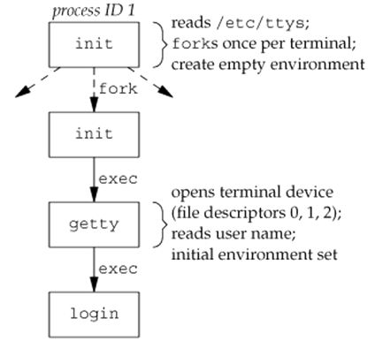

# Process Relationship

## Table of Contents

* [Process Relationship](#process-relationship)
  * [Table of Contents](#table-of-contents)
  * [Login](#login)
  * [Process Groups](#process-groups)
  * [Sessions](#sessions)
  * [Controlling Terminal](#controlling-terminal)
  * [Job Control](#job-control)
  * [Shell Execution of Programs](#shell-execution-of-programs)
  * [Orphaned Process Groups](#orphaned-process-groups)

## Login

* Linux Booting Process
  * first process: `/sbin/init`
    * PID is 1
    * configurations: `/etc/inittab`, `/etc/event.d/*`, or `/etc/init/*`
  * run levels
    * 0: halted
    * 6: reboot
    * 1 to 5 can be customized
      * default run level often set to 2, 3 or 5
  * enable console logs
* Linux Terminal Logins (e.g. Ubuntu)
  * start 6 consoles terminals for login
  * can be switched by Alt + F1 to F6
  * `getty` program
    * call open for `/dev/tty1`, `/dev/ttyS0`, ...
    * create file descriptor 0, 1 and 2
    * show login prompt
    * when user provide name, invoke `/bin/login` program
      * `execle("/bin/login", "login", "-p", username, (char *)0, envp);`
  * `login` program
    * display `Password` prompt
    * read password by `getpass(3)`
    * read encrypted password
    * encrypt input and compare password
    * if fails, the program terminates and `init` restart `getty`
  * after successful `login`
    * `chdir` to user's home directory
    * `chown` the terminal device owner to user
    * set the access permissions for the terminal device
    * `setgid` set group IDs
    * `initgroups` initialize the supplementary group access list
    * initialize the environment variables
    * `setuid` set user ID and invoke a login shell

  
* Network Logins – via the `telnetd` Program
  * open a pseudo-terminal device
    * `/dev/pts/N`
  * splits into two processes using fork
    * parent handles the communication across the network connection
    * child does an exec of the login program
  * whether we log in through a terminal or a network connection ...
    * we have a login shell
    * std in/out/err are connected to either a terminal device or a pseudo-terminal device
  
  

## Process Groups

* Definition
  * a collection of one or more processes, usually same jobs
* Properties
  * parent process can wait children in a process group
  * signals can be sent to processes in a process group
* `getpgid(2)`: `pid_t getpgid(pid_t pid);`
* `getpgrp(2)`: `pid_t getpgrp(void);` = `getpgid(0)`
* Group Leader
  * leader process group ID equals its process ID
  * leader can create a group, create processes in the group, and then quit
* Process Group Lifetime
  * start on the creation of the group
  * end when the last process in the group leaves
* Create/Join a Process Group
  * `setpgid(2)`: `int setpgid(pid_t pid, pid_t pgid);`
    * set process group ID of process `pid` to `pgid`
    * if `pid` equals `pgid`, then process `pid` becomes leader
    * if `pid` equals 0, then `pid` is replaced by the caller `pid`
    * if `pgid` equals 0, then `pgid` is replace by the value `pid`
  * `setpgid` limitations
    * process can only perform `setpgid` to itself or its children
    * process can not perform `setpgid` after its child calls `exec`
  * use of `setpgid` function
    * called after `fork`, parent sets child process group ID
    * child sets its own process group ID
    * above two actions are redundant, but they guaranteed that the child is placed into its own process group

## Sessions

* Definition
  * a collection of one or more process groups
  * pipes are used to generate process group
    * `$ prog1 | prog2 | prog3`
    * these three programs are in the same process group
* Create a Session
  * `setsid(2)`: `pid_t setsid(void);`
  * return: `pgid` or -1 if caller is process group leader
  * if the process is not a process group leader, the function creates a new session
    * the process becomes session leader
    * the process is the only process in the session
    * the process becomes the process group leader of a new process group
    * the new process group ID is the process ID of the calling process
    * the process has no controlling terminal
* Get Current Session ID
  * `getsid(2)`: `pid_t getsid(pid_t pid);`
  * return: the session leader's process group ID, -1 on error
  * if `pid` is 0, `pid` is replaced by caller process ID
* when user login, the session leader is usually the shell

## Controlling Terminal

* a session can have a single controlling terminal
  * terminal device or pseudo-terminal device
  * the session leader that establishes the connection to the controlling terminal is called the controlling process
* the process groups within a session can be divided into:
  * a single foreground process group
  * one or more background process groups
* if a session has a controlling terminal
  * it has a single foreground process group
  * all other process groups in the session are background process groups
* User control keys
  * send signals to all processes in the foreground process group
  * interrupt key (often Ctrl + C): send `SIGINT`
  * quit key (often Ctrl + Backspace): send `SIGQUIT`
  * if a network disconnect is detected by the terminal interface, the `SIGHUP` is sent to the controlling process


* Whom to Send Signals
  * `tcgetpgrp(3)`: `pid_t tcgetpgrp(int fd);`
    * get terminal foreground process group
  * `tcsetpgrp(3)`: `int tcsetpgrp(int fd, pid_t pgrp);`
    * only set by controlling process
  * most applications don't call above two functions
    * normally called by job-control shells
* Direct Access to the Controlling Terminal
  * even stdin or stdout is redirected
  * this can be done by open file `/dev/tty`
    * synonym within the kernel for the controlling terminal
    * the program must have a controlling terminal, otherwise open will fail

## Job Control

* start multiple jobs from a single terminal
* requirements
  * a shell that supports job control
  * the terminal driver in the kernel must support job control
  * the kernel must support certain job-control signals
* start a job in background: `&` operator
* stop job running in foreground
  * Ctrl + z
  * `SIGTSTP` is sent to all processes in the foreground process group
* `SIGTTIN` and `SIGTTOU`
  * processes in the foreground process group is always able to read from and write to the terminal
  * but background process is restricted to do so
  * signal will send to the background process
  * `SIGTTIN`: signal of reading from terminal
    
  * `SIGTTOU`: signal of writing to terminal
    
* job control summary  
  

## Shell Execution of Programs

* `ps -o pid,ppid,pgid,sid,comm | cat1 | cat2`

  ``` txt
  PID  PPID PGID SID COMMAND
  949  947  949  949 sh
  1988 949  949  949 cat2
  1989 1988 949  949 ps
  1990 1988 949  949 cat1
  ```

## Orphaned Process Groups

* Definition
  * the parent process of every member is either
    1. a member of the group or
    2. not a member of the group's session
* In contrast, process group is not orphaned if
  * a process in the group has a parent in a different process group but in the same session
* If a process group becomes orphaned
  * every stopped process in the group is sent the `SIGHUP` followed by the `SIGCONT`
  * the default action on receipt of a `SIGHUP` is to terminate the process
* Example

  ``` C
  int main() {
    char c;
    pid_t pid;  
    pr_ids("parent");
    if ((pid = fork()) < 0) {
      err_sys("fork error");
    } else if (pid > 0) {
      sleep(5);
    } else {
      pr_ids("child");
      signal(SIGHUP, sig_hup);  /* establish signal handler */
      kill(getpid(), SIGTSTP);  /* stop ourself */
      pr_ids("child");          /* prints only if we're continued */
      if (read(STDIN_FILENO, &c, 1) != 1)
        printf("read error %d on controlling TTY\n", errno);
    }
    exit(0);
  }
  ```

  ``` txt
  parent: pid = 6099, ppid = 2837, pgrp = 6099, tpgrp = 6099
  child: pid = 6100, ppid = 6099, pgrp = 6099, tpgrp = 6099
  (sleep for 5 seconds)
  SIGHUP received, pid = 6100
  child: pid = 6100, ppid = 1, pgrp = 6099, tpgrp = 2837
  read error from controlling TTY, errno = 5
  ```

  1. the parent and the child prints out their own information
  2. the parent then sleeps for 5 seconds
  3. the child stopped itself
  4. when the parent terminates, the child received `SIGHUP` and `SIGCONT`
  5. since the child has assigned the `SIGHUP` handler, it is not terminated
  6. the child is now in background, so read from TTY got the `EIO` error
