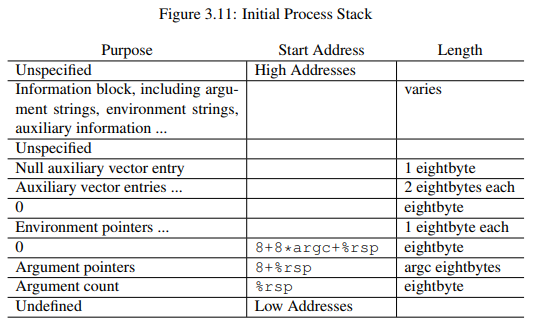

# Assembly

## Table of Contents

* [Assembly](#assembly)
  * [Table of Contents](#table-of-contents)
  * [Overview](#overview)
  * [Calling Convention](#calling-convention)
  * [Stack Frame](#stack-frame)
  * [Integrate C and Assembly](#integrate-c-and-assembly)

## Overview

* x86_64 assembly
* [tutorial](https://www.tutorialspoint.com/assembly_programming/)
* Intel assembly syntax

## Calling Convention

* language/architecture dependent
* system calls have their own calling convention
  * where is the return address
  * how parameters are passed before making a call
  * how parameters are cleared after returning from a call
  * how return values are received
* Calling Convention: Intel x86
  * cdecl: C/C++
    * caller pushes parameters to the stack, **from right to left**
    * **caller** is responsible to remove parameters from the stack
  * stdcall: Windows API
    * caller pushes parameters to the stack, **from right to left**
    * **callee** is responsible to remove parameters from the stack
  * return value is stored in EAX register
* Calling Convention: Intel x86_64
  * register can be used to pass function call parameters
  * System V AMD64
    * the first 6 are passed by `RDI`, `RSI`, `RDX`, `RCX`, `R8`, `R9`
    * the rest are pushed onto stack from **right to left**
  * Microsoft x64
    * the first 4 are passed by `RCX`, `RDX`, `R8`, `R9`
    * the rest are pushed onto stack from **right to left**
  * return value is stored in `RAX`
  * stack parameter are always removed by the caller
* Tools for Understand Assembly in UNIX
  * `gcc` options
    * `-m32`: Intel x86 object codes
    * `-masm=intel`: Intel syntax, with `-S` option
    * `-fno-stack-protector`: disable stack protector
  * `yasm` options
    * `-f elf32`: output x86 object codes
    * `-f elf64`: output x86_64 object codes
  * `ld` options
    * `-m elf_i386`: link with x86 object codes
    * `-m elf_x86_64`: link with x86_64 object codes
  * `objdump -d`: disassemble
  * `gdb-peda`: debugger

    ``` bash
    git clone https://github.com/longld/peda.git ~/peda
    echo "source ~/peda/peda.py" >> ~/.gdbinit
    ```

* gdb `x` command
  * `x [Address expression]`
  * `x /[Format] [Address expression]`
  * `x /[Length][Format] [Address expression]`
  * `x`
  * format `i`: instruction
  * e.g. `x/9i main`

## Stack Frame

* Enter Function
  * `push rbp`
  * `mov rbp, rsp`
  * `sub rsp, 0x10  ; locals`
* Call Function
  * set corresponding parameters
  * `call 0x61c <b>`
    * push return address (next instruction after `call`)
    * set `eip` to `0x61c` (callee)
* Leave Function
  * `leave`
    * `mov rsp, rbp`
    * `pop rbp`
* Stack Frame (x86_64)
  |  Value (High to Low Address)   |
  | :----------------------------: |
  |    0x40055a [ret to main()]    |
  | 0x7fffffffe4c0 [RBP of main()] |
  |     ... 16 bytes local ...     |
  |     0x400540 [ret to a()]      |
  |  0x7fffffffe4b0 [RBP of a()]   |
  |     ... 16 bytes local ...     |
  |     0x40051b [ret to b()]      |
  |  0x7fffffffe490 [RBP of b()]   |
* Stack Frame (x86)
  | Value (High to Low Address)  |
  | :--------------------------: |
  |     0x03 [parameter #3]      |
  |     0x02 [parameter #2]      |
  |     0x01 [parameter #1]      |
  | 0x8048421 [return to main()] |
  |  0xffffd5f8 [EBP of main()]  |
  |        0x111 [local]         |
  |        0x222 [local]         |
  |        0xccc [local]         |

## Integrate C and Assembly

* Hello World
  * x86_64 system call:
    * [reference](http://blog.rchapman.org/posts/Linux_System_Call_Table_for_x86_64/)
    * convention: `rax <- rdi rsi rdx r10 r8 r9`
      * x86 convention: `eax <- ebx ecx edx esx edi`
    * `yasm -f elf64 -DPIC hello_sys.asm`
    * `ld -m elf_x86_64 -o hello_sys hello_sys.o`
    * `hello_sys.asm`

      ``` llvm
          section .data
      msg: db "hello, world!", 0x0a, 0
          section .text
          global _start
      _start:
          mov rax, 1
          mov rdi, 1      ; stdout
          mov rsi, msg    ; buffer
          mov rdx, 14     ; length
          syscall         ; syscall: write
          mov rax, 60
          mov rdi, 0      ; code
          syscall         ; syscall: exit
          ret
      ```

  * C library
    * `yasm -f elf64 -DPIC hello_libc.asm`
    * `gcc -o hello_libc hello_libc.o`
      * if we do `ld -m elf_x86_64 -o hello_libc hello_libc.o`
      * then it will pop error `undefined reference to puts`
    * `hello_libc.asm`

      ``` llvm
          section .data
      msg: db "hello, world!", 0
          extern    puts    ; int puts(const char *)
          section .text
          global main
      main:
      %ifdef NASM
          lea rdi, [rel msg]
      %else
          lea rdi, [msg wrt rip]
      %endif
          call puts wrt ..plt
          mov rax, 0
          ret
      ```

* Library Implemented in Assembly
  * things needed
    * self-made header file
    * self-made object implements `_start`
    * self-made mini C library in C
    * self-made system call functions in assembly
    * user program
  * header `libmini.h`
    * data type
    * constants
    * native system calls
    * syscall wrappers
    * additional functions
  * entry point: `start.o`
    * `yasm -f elf64 -DYASM -D__x86_64__ -DPIC start.asm`
    * [System V AMD 64 ABI](https://software.intel.com/sites/default/files/article/402129/mpx-linux64-abi.pdf])

      

    * `start.asm`

      ``` llvm
      extern main
      extern exit
        section .text
        global _start
      _start:
        mov rdi, [rsp]    ; argc
        lea rsi, [rsp+8]  ; argv
        call  main
        mov rdi, rax      ; exit code
        call  exit
        ret
      ```

    * Note
      * `[]` stands for deference of the address
      * but `lea` + `[]` stands for copy the address to the register

  * library: `libmini64.a`
    * wrapper, library implementation: `libmini.c`
      * include `libmini.h`
      * `read`, `write`, ...
      * `gcc -c -g -Wall -masm=intel -fno-stack-protector -fPIC -nostdlib libmini.c`
    * implementation of system call functions: `libmini64.asm`
      * `sys_read`, `sys_write`, ...
      * `yasm -f elf64 -DYASM -D__x86_64__ -DPIC libmini64.asm`
    * use `ar` to generate static library
      * `ar`: used for create, modify, and extract from archives
      * option `r`: insert the files member... into archive (with replacement)
      * option `c`: create the archive
      * option `v`: verbose operation
      * `ar rcv libmini64.a libmini64.o libmini.o`
    * or use `ld` to generate dynamic library
      * `ld -shared libmini64.o libmini.o -o libmini64.so`
  * user program: `cat1.o`
    * include `libmini.h`
    * `gcc -c -g -Wall -masm=intel -fno-stack-protector cat1.c`
  * link all programs
    * static: `ld -m elf_x86_64 -o cat1 cat1.o libmini64.a start.o`
    * dynamic: `ld -m elf_x86_64 --dynamic-linker /lib64/ld-linux-x86-64.so.2 -o cat1 start.o cat1.o -L. -lmini64`
      * execution: `LD_LIBRARY_PATH=. ./cat1`
* Functions Implemented by System Calls
  * `printf`: `sys_write`
  * `signal`: `sys_rt_sigaction`
  * `sleep`: `sys_nanosleep`

    ``` C
    unsigned int sleep(unsigned int s) {
      long ret;
      struct timespec req = {s, 0};
      struct timespec rem;
      ret = sys_nanosleep(&req, &rem);
      if (ret >= 0) { return ret; }
      if (ret == -EINTR) { return rem.tv_sec; }
      return 0;
    }
    ```

  * `open`: `sys_open`
* Implement Functions in Assembly
  * `sleep`

    ``` llvm
      global sleep:function
    sleep:
      sub rsp, 32           ; allocate timespec (16 bytes) * 2
      mov [rsp], rdi        ; req.tv_sec, rdi size = 64bits = 8 bytes
      mov QWORD [rsp+8], 0  ; req.tv_nsec, QWORD = word (2 bytes) *  4
      mov rdi, rsp          ; rdi = req @ rsp
      lea rsi, [rsp+16]     ; rsi = rem @ rsp+16
      call sys_nanosleep
      cmp rax, 0            ; if (ret >= 0)
      jge sleep_quit        ;   go sleep_quit, return ret
    sleep_error:
      neg rax
      cmp rax, 4            ; if (ret != -EINTR)
      jne sleep_failed      ;   go sleep_failed
    sleep_interrupted:
      lea rsi, [rsp+16]
      mov rax, [rsi]        ; return rem.tv_sec
      jmp sleep_quit
    sleep_failed:           ; return 0  // but error
      mov rax, 0
    sleep_quit:
      add rsp, 32
      ret
    ```

  * `open`
    * declaration
      * `int open(const char *pathname, int flags);`
      * `int open(const char *pathname, int flags, mode_t mode);`
    * might be easier to implement in assembly

    ``` llvm
      global open:function
    open:
      call sys_open
      cmp rax, 0
      jge open_success   ; no error :)
    open_error:
      neg rax
    %ifdef NASM
      mov rdi, [rel errno wrt ..gotpc]
    %else
      mov rdi, [rel errno wrt ..gotpcrel]
    %endif
      mov [rdi], rax     ; errno = -rax
      mov rax, -1
      jmp open_quit
    open_success:
    %ifdef NASM
      mov rdi, [rel errno wrt ..gotpc]
    %else
      mov rdi, [rel errno wrt ..gotpcrel]
    %endif
      mov QWORD [rdi], 0 ; errno = 0
    open_quit:
      ret
    ```

* System Call Return Value
  * always `long` (8 bytes) for x86_64
  * returned result (usually casted to the correct data type)
  * or an `errno` code (if it is less than zero)