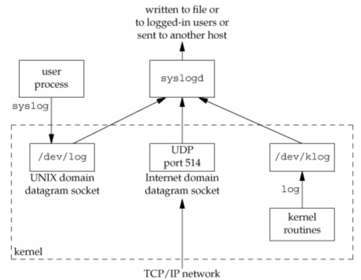
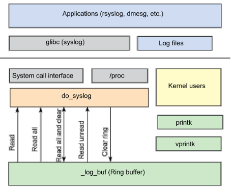

# Daemon Process

* [Daemon Process](#daemon-process)
  * [Introduction](#introduction)
  * [Daemon Conventions](#daemon-conventions)
  * [Client Server Model](#client-server-model)
  * [Coding Rules](#coding-rules)
  * [Error Logging](#error-logging)
  * [Single Instance Daemon](#single-instance-daemon)

## Introduction

* Processes Live for a Long Time
  * often started when the system is up and terminate when it is down
  * do not have a controlling terminal
  * run in background
  * partial output `ps ajx`
    * `x`: process without terminal
    * `j`: show job related information
    * processes enclosed by `[]` are kernel processes

## Daemon Conventions

* Lock File
  * if daemon uses a lock file, it is usually stored in `/var/run/name.pid`
  * use to check the existence of a running daemon
  * might need superuser permissions to create a file here
* Configuration Options
  * usually stored in `/etc`, named `name.conf`
  * daemon usually reads it only if it starts
  * some daemon will read configuration again when received `SIGHUP`
* Start
  * start from `/etc/rc*` or `/etc/init.d/*`

## Client Server Model

* daemon is common to use as server
* e.g.
  * client: `syslog` library call
  * server: `syslogd` daemon

## Coding Rules

1. `umask(2)` to reset permission masks
2. `fork(2)` and parent exit
   * not block the shell
   * not a process group leader
     * child inherits the process group ID of the parent
     * but gets a new process ID
   * can be a session leader
3. `setsid(2)`
   * become a session leader
   * become a process group leader
   * no controlling terminal
   * System V systems suggest to `fork(2)` again and terminate the parent
     * child continues as the daemon, and not a session leader
     * prevent the child from acquiring controlling terminal
4. change the current working directory, may be root directory
5. close unused file descriptors, and redirect {0, 1, 2} to `/dev/null`
6. setup log files or log systems

## Error Logging

* Logging
  * daemon cannot write error message to standard error
  * a centralized place to collect logs from all daemons
  * `syslog` facility initially proposed in the BSD system
  * many systems derived the design from `syslogd`
  * e.g. Linux’s `rsyslogd`: a reliable and extended of `syslogd`

  
* Linux Kernel Logging Stack
  * `syslog(2)`: read and clear the kernel log buffer
  * `syslog(3)`: write log to log system

  
* `syslog(3)`
  * `void openlog(const char *ident, int option, int facility);`
  * `void syslog(int priority, const char *format, ...);`
  * `void closelog(void);`
  * the call to `openlog(3)` is optional
    * it will be called on the first call to `syslog(3)`
  * the call to `closelog(3)` is optional
    * it simply close the descriptor
  * `priority` argument can be specified by facility and level together
  * option
    | Option       | Description                                                                          |
    | :----------- | :----------------------------------------------------------------------------------- |
    | `LOG_CONS`   | Write to the console if there is an error while sending to the system logger         |
    | `LOG_NDELAY` | Open the connection immediately instead of opening when the first message is logged  |
    | `LOG_NOWAIT` | Do not wait for child processes that may have been created while logging the message |
    | `LOG_ODELAY` | Delay the connection until `syslog(3)` is called                                     |
    | `LOG_PERROR` | (Not in POSIX.1-2001 or POSIX.1-2008.)  Also log the message to `stderr`             |
    | `LOG_PID`    | Include the caller's PID with each message                                           |
  * facility
    | Facility       | Description                                                    |
    | :------------- | :------------------------------------------------------------- |
    | `LOG_AUTH`     | security/authorization messages                                |
    | `LOG_AUTHPRIV` | security/authorization messages (private)                      |
    | `LOG_CRON`     | clock daemon (cron and at)                                     |
    | `LOG_DAEMON`   | system daemons without separate facility value                 |
    | `LOG_FTP`      | ftp daemon                                                     |
    | `LOG_KERN`     | kernel messages (these can't be generated from user processes) |
    | `LOG_LOCAL0~7` | reserved for local use                                         |
    | `LOG_LPR`      | line printer subsystem                                         |
    | `LOG_MAIL`     | mail subsystem                                                 |
    | `LOG_NEWS`     | USENET news subsystem                                          |
    | `LOG_SYSLOG`   | messages generated internally by `syslogd(8)`                  |
    | `LOG_USER`     | generic user-level messages(default)                           |
    | `LOG_UUCP`     | UUCP subsystem                                                 |
  * level
    | Level         | Description                        |
    | :------------ | :--------------------------------- |
    | `LOG_EMERG`   | system is unusable                 |
    | `LOG_ALERT`   | action must be taken immediately   |
    | `LOG_CRIT`    | critical conditions                |
    | `LOG_ERR`     | error conditions                   |
    | `LOG_WARNING` | warning conditions                 |
    | `LOG_NOTICE`  | normal, but significant, condition |
    | `LOG_INFO`    | informational message              |
    | `LOG_DEBUG`   | debug-level message                |
* `setlogmask(3)`: `int setlogmask(int mask);`
  * can be used to restrict logging to specified levels only.
* Example

  ``` C
  // line printer spooler daemon
  openlog("lpd", LOG_PID, LOG_LPR);
  syslog(LOG_ERR, "open error for %s: %m", filename);
  // an almost equivalent implementation
  syslog(LOG_ERR | LOG_LPR, "open error for %s: %m", filename);
  ```

## Single Instance Daemon

* Single Instance
  * some daemons are implemented so that only a single copy is allowed
  * e.g. the daemon might need exclusive access to a device
    * the cron daemon
* Codes to Check Daemon Existence

  ``` C
  int already_running(d) {
    int fd;
    char buf[16];
    if ((fd = open(LOCKFILE, O_RDWR | O_CREAT, LOCKMODE)) < 0) {
      syslog(LOG_ERR, "can't open %s: %s", LOCKFILE, strerror(errno));
      exit(1);
    }
    if (lockfile(fd) < 0) {
      if (errno == EACCES || errno == EAGAIN) {
        close(fd);
        return 1;
      }
      syslog(LOG_ERR, "can't lock %s: %s", LOCKFILE, strerror(errno));
      exit(1);
    }
    ftruncate(fd, 0);
    sprintf(buf, "%ld\n", (long)getpid());
    write(fd, buf, strlen(buf));
    return 0;
  }
  ```
