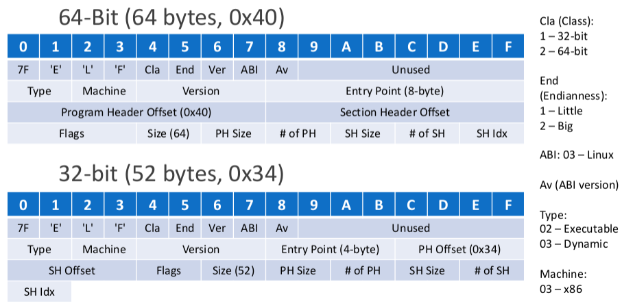

# Ptrace

* [Ptrace](#ptrace)
  * [Overview](#overview)
  * [Basic Control](#basic-control)
  * [Applications](#applications)
    * [Instruction Counter](#instruction-counter)
    * [Execution Trace Dump](#execution-trace-dump)
    * [System Call Tracer](#system-call-tracer)
    * [Change Program Control Flow](#change-program-control-flow)
    * [Automated Debugger](#automated-debugger)
  * [Handle Breakpoints](#handle-breakpoints)

## Overview

* ptrace is a system call
* allow a process (tracer) to observe and control execution of another process (tracee)
  * memory read/write
  * register read/write
  * monitor runtime state changes
* `ptrace(2)`: `long ptrace(enum __ptrace_request request, pid_t pid, void *addr, void *data)`
  | `request`           | Description                                                         |
  | :------------------ | :------------------------------------------------------------------ |
  | `PTRACE_ATTACH`     | Attach to a process                                                 |
  | `PTRACE_DETACH`     | Detach from a tracee, and restart the process                       |
  | `PTRACE_TRACEME`    | Indicate that this process is to be traced by its parent            |
  | `PTRACE_CONT`       | Restart the stopped tracee process                                  |
  | `PTRACE_SYSCALL`    | `PTRACE_CONT`, but stop at the next entry to or exit from a syscall |
  | `PTRACE_SINGLESTEP` | `PTRACE_CONT`, but stop after execution of a single instruction     |
  | `PTRACE_PEEKDATA`   | Read a word from tracee's memory                                    |
  | `PTRACE_PEEKUSER`   | Read a word from tracee's user data (usually registers)             |
  | `PTRACE_GETREGS`    | Copy the tracee's general-purpose registers                         |
  | `PTRACE_POKEDATA`   | Write a word to tracee's memory                                     |
  | `PTRACE_POKEUSER`   | Write a word to tracee's user data (usually registers)              |
  | `PTRACE_SETREGS`    | Modify the tracee's general-purpose registers                       |
  | `PTRACE_SETOPTIONS` | Set ptrace options                                                  |

## Basic Control

* `ptrace(PTRACE_ATTACH, child, 0, 0)`
  * return: 0 OK, -1 error
  * usually parent can trace its child
  * parent calls `PTRACE_ATTACH` or child calls `PTRACE_TRACEME`
  * `SIGSTOP` is sent to the tracee
    * use `waitpid(2)` to wait for the child process
    * determine the status of the child by using `WIFSTOPPED()`
  * restrictions: `/proc/sys/kernel/yama/ptrace_scope`
    | Number | Description                                                                   |
    | :----: | :---------------------------------------------------------------------------- |
    |  `0`   | classic ptrace permission: no restriction                                     |
    |  `1`   | restricted ptrace: allow a parent and process having `CAP_SYS_PTRACE` ability |
    |  `2`   | admin-only: allow only process having the `CAP_SYS_PTRACE` ability            |
    |  `3`   | no attach                                                                     |
* `ptrace(PTRACE_TRACEME, 0, 0, 0)`
  * return: 0 OK, -1 error
  * turn a process to a tracee, traced by its parent
  * typical implementation
    * parent fork a child
    * child calls `PTRACE_TRACEME`, then
      * raise `SIGSTOP` to stop itself or
      * `exec` another program, a `SIGTRAP` will be delivered to its parent
        * `PTRACE_O_TRACEEXEC` option should be disabled (default)
    * parent waits for the child, and then control it
* `ptrace(PTRACE_CONT, child, 0, sig)`
  * return: 0 OK, -1 error
  * restart the stopped tracee
  * a tracee is stopped if
    * attached by a tracer
    * child calls `PTRACE_TRACEME` and `exec`
  * `sig` is usually 0 -> no signal is delivered to the tracee
* Minimal Example
  
  ``` C
  int main(int argc, char *argv[]) {
    pid_t child;
    if (argc < 2) {
      fprintf(stderr, "usage: %s program\n", argv[0]);
      return -1;
    }
    if ((child = fork()) < 0) errquit("fork");
    if (child == 0) {
      if (ptrace(PTRACE_TRACEME, 0, 0, 0) < 0) errquit("ptrace");
      execvp(argv[1], argv + 1);
      errquit("execvp");
    } else {
      int status;
      if (waitpid(child, &status, 0) < 0) errquit("wait");
      assert(WIFSTOPPED(status));
      // PTRACE_O_EXITKILL: kill tracee if tracer exits
      ptrace(PTRACE_SETOPTIONS, child, 0, PTRACE_O_EXITKILL);
      ptrace(PTRACE_CONT, child, 0, 0);
      waitpid(child, &status, 0);
      perror("done");
    }
    return 0;
  }
  ```

* Finer Program Control Flow Granularity
  * `ptrace(PTRACE_SINGLESTEP, child, 0, 0)`
    * return: 0 OK, -1 error
    * stop after execution of a single instruction
  * `ptrace(PTRACE_SYSCALL, child, 0, 0)`
    * return: 0 OK, -1 error
    * stop at the next entry to or exit from a syscall
    * differentiate between regular stop and syscall stop
      * pass `PTRACE_O_TRACESYSGOOD` option
      * then return status will add 0x80 if it is syscall stop
      * example

      ``` C
      ptrace(PTRACE_SETOPTIONS, child, 0, PTRACE_O_EXITKILL | PTRACE_O_TRACESYSGOOD);
      if (WSTOPSIG(status) & 0x80) {
        // it is syscall stop
      }
      ```

    * knowing syscall stop, differentiate between entry point and exit point
      * setup a counter
      * stop must start from entry, exit, entry, ... and so on
      * example

      ``` C
      int enter = 0x01;
      ...
      if (WSTOPSIG(status) & 0x80) {
        if (enter) { /* entry */ }
        else { /* exit */ }
        enter ^= 0x01
      }
      ```

    * work with `PTRACE_GETREGS`
      * for entry point: syscall id will store in `orig_rax` of struct `user_regs_struct`
      * for exit point: syscal return will store in `rax` of struct `user_regs_struct`
      * the rest parameters follows calling convention

* Reading From a Tracee
  * **clear `errno` before calling PEEK\* functions**
  * `ptrace(PTRACE_PEEKTEXT, child, addr, 0)`
    * return: a word, check `errno` for errors
    * same as `PTRACE_PEEKDATA`
    * read a word from tracee's memory address `addr`
    * `addr` alignment is hardware dependent
      * Intel: it is not necessary to be aligned, you can pass any address
  * `ptrace(PTRACE_PEEKUSER, child, offset, 0)`
    * return: a word, check `errno` for errors
    * read register word from tracee's user data area
    * `offset` usually has to be **word-aligned**
  * `ptrace(PTRACE_GETREGS, child, 0, data)`
    * return: 0 OK, -1 error
    * read general-purpose register to `data`
    * `data` should be stored in struct `user_regs_struct`
* Writing to a Tracee
  * `ptrace(PTRACE_POKETEXT, child, addr, word)`
    * return: 0 OK, -1 error
    * same as `PTRACE_POKEDATA`
    * write a word to tracee's memory address `addr`
    * `addr` alignment is hardware dependent
      * Intel: it is not necessary to be aligned, you can pass any address
  * `ptrace(PTRACE_POKEUSER, child, offset, word)`
    * return: 0 OK, -1 error
    * write register word to tracee's user data area
    * `offset` usually has to be **word-aligned**
  * `ptrace(PTRACE_SETREGS, child, 0, data)`
    * return: 0 OK, -1 error
    * write general-purpose register from `data`
    * `data` should be stored in struct `user_regs_struct`
* the term word is architecture dependent
  * 32-bit machine: 4 bytes
  * 64-bit machine: 8 bytes

## Applications

### Instruction Counter

``` C
int main(int argc, char *argv[]) {
  pid_t child;
  if (argc < 2) {
    fprintf(stderr, "usage: %s program [args ...]\n", argv[0]);
    return -1;
  }
  if ((child = fork()) < 0) errquit("fork");
  if (child == 0) {
    if (ptrace(PTRACE_TRACEME, 0, 0, 0) < 0) errquit("ptrace@child");
    execvp(argv[1], argv + 1);
    errquit("execvp");
  } else {
    uint64_t counter = 0;
    int wait_status;
    if (waitpid(child, &wait_status, 0) < 0) errquit("waitpid");
    ptrace(PTRACE_SETOPTIONS, child, 0, PTRACE_O_EXITKILL);
    while (WIFSTOPPED(wait_status)) {
      counter++;
      if (ptrace(PTRACE_SINGLESTEP, child, 0, 0) < 0) errquit("ptrace@parent");
      if (waitpid(child, &wait_status, 0) < 0) errquit("waitpid");
    }
    fprintf(stderr, "## %ld instruction(s) executed\n", counter);
  }
  return 0;
}
```

### Execution Trace Dump

``` C
while (WIFSTOPPED(wait_status)) {
  counter++;
  long ret;
  uint8_t *ptr = (uint8_t *)&ret;
  uint64_t rip;
  struct user_regs_struct regs;
  uint8_t offset = ((uint8_t *)&regs.rip) - ((uint8_t *)&regs);  // 128
#if USE_PEEKUSER
  if ((rip = ptrace(PTRACE_PEEKUSER, child, offset, 0)) != 0) {
#else
  if (ptrace(PTRACE_GETREGS, child, 0, &regs) == 0) {
    rip = regs.rip;
#endif
    ret = ptrace(PTRACE_PEEKTEXT, child, rip, 0);
    fprintf(stderr,
            "0x%lx: %2.2x %2.2x %2.2x %2.2x %2.2x %2.2x %2.2x %2.2x\n", rip,
            ptr[0], ptr[1], ptr[2], ptr[3], ptr[4], ptr[5], ptr[6], ptr[7]);
  }
  if (ptrace(PTRACE_SINGLESTEP, child, 0, 0) < 0) errquit("ptrace@parent");
  if (waitpid(child, &wait_status, 0) < 0) errquit("waitpid");
}
```

* Revise Above Code
  * show module names: `/proc/{pid}/maps`
  * show assembly codes
    * [Capstone](http://www.capstone-engine.org/)
      * disassembler
      * `sudo apt install libcapstone3 libcapstone-dev`
      * header: `/usr/include/capstone/capstone.h`
      * library: `/usr/lib/x86_64-linux-gnu/libcapstone.so.3`
* Disassemble in Three Steps
  * `cs_err cs_open(cs_arch arch, cs_mode mode, csh *handle);`
  * `size_t CAPSTONE_API cs_disasm(csh handle, const uint8_t *code, size_t code_size, uint64_t address, size_t count, cs_insn **insn);`
  * `cs_err cs_close(csh *handle);`

  ``` C
  csh cshhandle = 0;
  if (cs_open(CS_ARCH_X86, CS_MODE_64, &cshandle) != CS_ERR_OK) {
    return -1;
  }
  ...
  cs_insn *insn;
  if ((count = cs_disasm(cshandle, (uint8_t *)buf, bufsz, rip, 0, &insn)) > 0) {
    for (int i = 0; i < count; i++) {
      instruction in;
      in.size = insn[i].size;
      in.opr = insn[i].mnemonic;
      in.opnd = insn[i].op_str;
      memcpy(in.bytes, insn[i].bytes, insn[i].size);
      instructions[insn[i].address] = in;
    }
    cs_free(insn, count);
  }
  ...
  cs_close(&schandle);
  ```

### System Call Tracer

``` C
int enter = 0x01;
if (waitpid(child, &wait_status, 0) < 0) errquit("waitpid");
ptrace(PTRACE_SETOPTIONS, child, 0, PTRACE_O_EXITKILL | PTRACE_O_TRACESYSGOOD);
while (WIFSTOPPED(wait_status)) {
  struct user_regs_struct regs;
  if (ptrace(PTRACE_SYSCALL, child, 0, 0) != 0) errquit("ptrace@parent");
  if (waitpid(child, &wait_status, 0) < 0) errquit("waitpid");
  if (!WIFSTOPPED(wait_status) || !(WSTOPSIG(wait_status) & 0x80)) continue;
  if (ptrace(PTRACE_GETREGS, child, 0, &regs) != 0) errquit("ptrace@parent");
  if (enter) {
    /* rip has to subtract 2 because syscall is 0x0f 0x05 */
    /* print here */
    if (regs.orig_rax == 0x3c || regs.orig_rax == 0xe7)
      fprintf(stderr, "\n"); /* exit || exit_group */
    counter++;
  } else {
    fprintf(stderr, "0x%llx: ret = 0x%llx\n", regs.rip - 2, regs.rax);
  }
  enter ^= 0x01;
}
```

### Change Program Control Flow

* `JMP` Instruction
  |  Assembly   |    OP Code    |                Description                 |
  | :---------: | :-----------: | :----------------------------------------: |
  | `JMP rel8`  | `E8` + offset | Jump to RIP + 8-bit sign-extended address  |
  | `JMP rel32` | `E9` + offset | Jump to RIP + 32-bit sign-extended address |
  | `JMP r/m64` | `FF` + r/m64  |         Jump to the target address         |
* Patch Hidden Program
  * start address: 0x4000b0
  * hidden part: 0x4000cf to 0x40010e
  * strategy
    * jump to 0x4000cf from start
      * write 0xe8, offset to 0x4000b0
      * where `offset = 0x4000cf - 0x4000b0 - 2 = 0x1d`
      * because `eip` changes when perform 0xe8, offset

      ``` C
      uint8_t code[] = {0xeb, 0x1d, 0x90, 0x90, 0x90, 0x90, 0x90, 0x90};
      uint64_t *lcode = (uint64_t *)code;
      if (ptrace(PTRACE_POKETEXT, child, 0x4000b0, *lcode) != 0) {
        errquit("poketext");
      }
      ```

    * remove code that blocks the program to get in hidden part
      * 0x4000cd has jmp instruction to skip the hidden part
      * nop, 0x90 can be used

      ``` C
      uint64_t code = ptrace(PTRACE_PEEKTEXT, child, 0x4000cd, 0);
      uint64_t replace = (code & 0xffffffffffff0000) | 0x9090;
      if (ptrace(PTRACE_POKETEXT, child, 0x4000cd, replace) != 0) {
        errquit("poketext");
      }
      ```

### Automated Debugger

* Patch Guess Program
  * compare `secret` with user input, success if same
  * GDB way
    * setup breakpoint right before check
    * change the value of `secret` (or the input)
      * high level
        * input 1234
        * `set secret = 1234`
      * low level
        * `print $rdx`, get 48125085
        * `set $rax = 48125085`
  * `LD_PRELOAD` way
    * replace `rand` or `strtol` function
    * but it changes all behavior that calls `rand` or `strtol`
  * ptrace provides a fine grained control of the program
* Steps to Patch with `ptrace`
  1. run and **suspend** the program
  2. identify the location we want to stop the program
  3. setup a breakpoint
  4. **continue the execution**
  5. program stopped
  6. change the value, **and restore the breakpoint**
  7. continue the execution
* Identify the Location
  * check PIE
    * `checksec` tool
      * `pip3 install git+https://github.com/arthaud/python3-pwntools.git`
      * `checksec <exec>`
    * for PIE enabled program, it is loaded into random locations of virtual memory
    * compile without PIE -> use `-no-pie` flag
  * ELF format
    * **executable and linkable format**
    * elf header
    * program header (zero or more)
    * section header (zero or more)

      |  mode   | elf header | program header | section header |
      | :-----: | :--------: | :------------: | :------------: |
      | 32-bits |  52 bytes  | 32 bytes each  | 40 bytes each  |
      | 64-bits |  64 bytes  | 56 bytes each  | 64 bytes each  |

    * data, referred by program and section header

      
      
    

    ``` text
    $ hexdump -C /lib/x86_64-linux-gnu/libc.so.6 | head -n 4
    00000000  7f 45 4c 46 02 01 01 03  00 00 00 00 00 00 00 00  |.ELF............|
    00000010  03 00 3e 00 01 00 00 00  b0 1c 02 00 00 00 00 00  |..>.............|
    00000020  40 00 00 00 00 00 00 00  90 e9 1e 00 00 00 00 00  |@...............|
    00000030  00 00 00 00 40 00 38 00  0a 00 40 00 49 00 48 00  |....@.8...@.I.H.|
    $ readelf -h /lib/x86_64-linux-gnu/libc.so.6
    ELF Header:
      Magic:   7f 45 4c 46 02 01 01 03 00 00 00 00 00 00 00 00
      Class:                             ELF64
      Data:                              2's complement, little endian
      Version:                           1 (current)
      OS/ABI:                            UNIX - GNU
      ABI Version:                       0
      Type:                              DYN (Shared object file)
      Machine:                           Advanced Micro Devices X86-64
      Version:                           0x1
      Entry point address:               0x21cb0
      Start of program headers:          64 (bytes into file)
      Start of section headers:          2025872 (bytes into file)
      Flags:                             0x0
      Size of this header:               64 (bytes)
      Size of program headers:           56 (bytes)
      Number of program headers:         10
      Size of section headers:           64 (bytes)
      Number of section headers:         73
      Section header string table index: 72
    $ hexdump -C guess | head -n 4
    00000000  7f 45 4c 46 02 01 01 00  00 00 00 00 00 00 00 00  |.ELF............|
    00000010  03 00 3e 00 01 00 00 00  20 08 00 00 00 00 00 00  |..>..... .......|
    00000020  40 00 00 00 00 00 00 00  d0 24 00 00 00 00 00 00  |@........$......|
    00000030  00 00 00 00 40 00 38 00  09 00 40 00 22 00 21 00  |....@.8...@.".!.|
    $ readelf -h guess
    ELF Header:
      Magic:   7f 45 4c 46 02 01 01 00 00 00 00 00 00 00 00 00
      Class:                             ELF64
      Data:                              2's complement, little endian
      Version:                           1 (current)
      OS/ABI:                            UNIX - System V
      ABI Version:                       0
      Type:                              DYN (Shared object file)
      Machine:                           Advanced Micro Devices X86-64
      Version:                           0x1
      Entry point address:               0x820
      Start of program headers:          64 (bytes into file)
      Start of section headers:          9424 (bytes into file)
      Flags:                             0x0
      Size of this header:               64 (bytes)
      Size of program headers:           56 (bytes)
      Number of program headers:         9
      Size of section headers:           64 (bytes)
      Number of section headers:         34
      Section header string table index: 33
    ```

  * `PT_LOAD` program header (phdr)
    * 1, defined in `elf.h`
    * parts in elf file that can be loaded
      * `.text` and `.data`
    * kernel calls `mmap` to map them into virtual memory
  * section header (shdr)
    * describe what sections are available
    * `.text`, `.symtab`, `.strtab`, ...
  * example without PIE enable
    * loaded memory region: 0x0000~0x00d3 @ 0x400000
    * text segment: offset 0x00b0 (176), size 0x23 (35)
    * data segment: offset 0x00d4 (212), size 0x0f (15)
    * offset 211 contains 0x00, in order to align data segment
    * see maps and code from GDB
      * `gdb hello64`
      * `starti`
      * `info proc mapping`
      * `x/35bx 0x4000b0`

    ``` text
    $ readelf -l hello64
    Elf file type is EXEC (Executable file)
    Entry point 0x4000b0
    There are 2 program headers, starting at offset 64

    Program Headers:
      Type           Offset             VirtAddr           PhysAddr
                     FileSiz            MemSiz              Flags  Align
      LOAD           0x0000000000000000 0x0000000000400000 0x0000000000400000
                     0x00000000000000d3 0x00000000000000d3  R E    0x200000
      LOAD           0x00000000000000d4 0x00000000006000d4 0x00000000006000d4
                     0x000000000000000f 0x000000000000000f  RW     0x200000

     Section to Segment mapping:
      Segment Sections...
       00     .text
       01     .data
    $ readelf -S hello64
    There are 6 section headers, starting at offset 0x218:

    Section Headers:
      [Nr] Name              Type             Address           Offset
           Size              EntSize          Flags  Link  Info  Align
      [ 0]                   NULL             0000000000000000  00000000
           0000000000000000  0000000000000000           0     0     0
      [ 1] .text             PROGBITS         00000000004000b0  000000b0
           0000000000000023  0000000000000000  AX       0     0     16
      [ 2] .data             PROGBITS         00000000006000d4  000000d4
           000000000000000f  0000000000000000  WA       0     0     4
      [ 3] .symtab           SYMTAB           0000000000000000  000000e8
           00000000000000d8  0000000000000018           4     5     8
      [ 4] .strtab           STRTAB           0000000000000000  000001c0
           000000000000002b  0000000000000000           0     0     1
      [ 5] .shstrtab         STRTAB           0000000000000000  000001eb
           0000000000000027  0000000000000000           0     0     1
    Key to Flags:
      W (write), A (alloc), X (execute), M (merge), S (strings), I (info),
      L (link order), O (extra OS processing required), G (group), T (TLS),
      C (compressed), x (unknown), o (OS specific), E (exclude),
      l (large), p (processor specific)
    $ objdump -d -M intel hello64
    hello64:     file format elf64-x86-64


    Disassembly of section .text:

    00000000004000b0 <_start>:
      4000b0: b8 04 00 00 00        mov    eax,0x4
      4000b5: bb 01 00 00 00        mov    ebx,0x1
      4000ba: b9 d4 00 60 00        mov    ecx,0x6000d4
      4000bf: ba 0e 00 00 00        mov    edx,0xe
      4000c4: cd 80                 int    0x80
      4000c6: b8 01 00 00 00        mov    eax,0x1
      4000cb: bb 00 00 00 00        mov    ebx,0x0
      4000d0: cd 80                 int    0x80
      4000d2: c3                    ret
    $ dd if=hello64 bs=1 skip=172 count=35 | hexdump -C
    35+0 records in
    35+0 records out
    35 bytes copied, 0.000245707 s, 142 kB/s
    00000000  b8 04 00 00 00 bb 01 00  00 00 b9 d4 00 60 00 ba  |.............`..|
    00000010  0e 00 00 00 cd 80 b8 01  00 00 00 bb 00 00 00 00  |................|
    00000020  cd 80 c3                                          |...|
    00000023
    $ dd if=hello64 bs=1 skip=212 count=15 | hexdump -C
    15+0 records in
    15+0 records out
    15 bytes copied, 0.000139912 s, 107 kB/s
    00000000  68 65 6c 6c 6f 2c 20 77  6f 72 6c 64 21 0a 00     |hello, world!..|
    0000000f
    ```

  * compare between PIE enable and PIE not enable
    * program header

      ``` text
      $ readelf -l nopie
      Elf file type is EXEC (Executable file)
      Entry point 0x400400
      ...
        LOAD           0x0000000000000000 0x0000000000400000 0x0000000000400000
                       0x00000000000006d0 0x00000000000006d0  R E    0x200000
        LOAD           0x0000000000000e10 0x0000000000600e10 0x0000000000600e10
                       0x0000000000000220 0x0000000000000228  RW     0x200000
      ...
      $ readelf -l pie
      Elf file type is DYN (Shared object file)
      Entry point 0x530
      ...
        LOAD           0x0000000000000000 0x0000000000000000 0x0000000000000000
                       0x0000000000000838 0x0000000000000838  R E    0x200000
        LOAD           0x0000000000000db8 0x0000000000200db8 0x0000000000200db8
                       0x0000000000000258 0x0000000000000260  RW     0x200000
      ...
      ```

    * section header

      ``` text
      $ readelf -S nopie
      There are 29 section headers, starting at offset 0x18e8:

      Section Headers:
      ...
        [13] .text             PROGBITS         0000000000400400  00000400
             0000000000000172  0000000000000000  AX       0     0     16
      ...
      $ readelf -S pie
      There are 29 section headers, starting at offset 0x1930:

      Section Headers:
      ...
        [14] .text             PROGBITS         0000000000000530  00000530
             00000000000001a2  0000000000000000  AX       0     0     16
      ...
      ```

    * vmmap

      ``` text
      # nopie
      0000000000400000-0000000000401000 r-xp 0        .../nopie
      0000000000600000-0000000000602000 rw-p 0        .../nopie
      # pie
      0000557a39a2c000-0000557a39a2d000 r-xp 0        .../pie
      0000557a39c2c000-0000557a39c2e000 rw-p 0        .../pie
      # pie in gdb will always map .text to 0x0000555555554000 for debug
      0000555555554000-0000555555555000 r-xp 0        .../pie
      0000555555755000-0000555555756000 rw-p 0        .../pie
      ```

## Handle Breakpoints

* `INT` Instruction
  * `int 0x??` -> machine code `0xcd 0x??`
  * `int 0x13`: x86 BIOS disk IO functions (real-mode)
  * `int 0x10`: x86 BIOS video functions (read-mode)
  * `int 0x21`: x86 DOS APIs (real-mode)
  * `int 0x80`: x86 Linux system call functions
* `0xcc` Machine Code
  * used for breakpoints in debuggers
  * similar to `int 0x03`, but only one byte
  * good for code patching, and fit to any size of instructions
  * operation
    * trigger `int 0x03`
    * send `SIGTRAP` to tracer
    * child stop right after `0xcc`
* Breakpoints
  * setup: replace code with `0xcc`
  * once a break point is hit
    * determine which break point is hit by `rip`
    * do anything about monitor or change state
    * restore the code, `0xcc` must be replace with the original byte
    * restore rip
    * continue program execution
  * solution of reuse the breakpoint
    * use `PTRACE_SINGLESTEP` to run the restored instruction
    * then put `0xcc` back to the address
* Example

  ``` C
  uint64_t code = ptrace(PTRACE_PEEKTEXT, child, target, 0);
  uint64_t replace = (code & 0xffffffffffffff00) | 0xcc;
  if (ptrace(PTRACE_POKETEXT, child, target, replace) != 0)
    errquit("ptrace(POKETEXT)");
  ptrace(PTRACE_CONT, child, 0, 0);
  while (waitpid(child, &status, 0) > 0) {
    struct user_regs_struct regs;
    if (!WIFSTOPPED(status)) continue;
    if (ptrace(PTRACE_GETREGS, child, 0, &regs) != 0) errquit("ptrace(GETREGS)");
    if (regs.rip - 1 == target) {
      /* restore break point */
      if (ptrace(PTRACE_POKETEXT, child, target, code) != 0)
        errquit("ptrace(POKETEXT)");
      /* set registers */
      regs.rip = regs.rip - 1;
      regs.rdx = regs.rax;
      if (ptrace(PTRACE_SETREGS, child, 0, &regs) != 0)
        errquit("ptrace(SETREGS)");
    }
    ptrace(PTRACE_CONT, child, 0, 0);
  }
  ```
