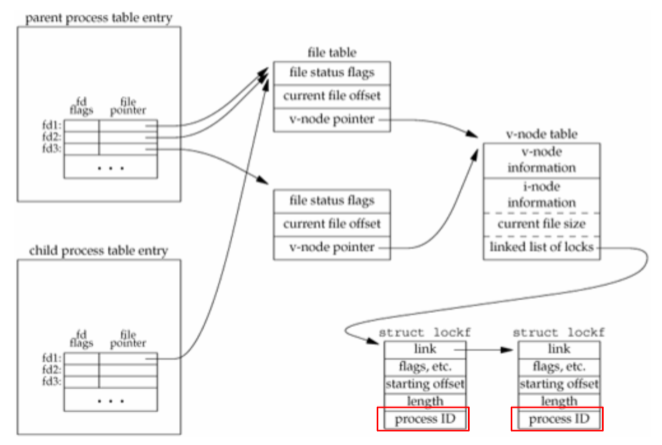

# Advanced I/O

## Non-blocking I/O

* Many I/O Operations Are Slow or Blocked Forever
  * read from pipe, terminal devices, and network devices
  * write to a pipe (full buffer) and network devices (enable flow control)
  * open a pipe for write, but no reader is available
  * read or write of files that have mandatory record locking enabled
  * ioctl operations
  * some other IPC functions
* Non-blocking I/O
  * if an operation cannot be completed, an error is returned
  * it may return partial results
* Example

  ``` C
  void set_fl(int fd, int flags) {
    int val;
    if ((val = fcntl(fd, F_GETFL, 0)) < 0) errquit("get flag");
    val |= flags;
    if (fcntl(fd, F_SETFL, val) < 0) errquit("set flag");
  }

  void clr_fl(int fd, int flags) {
    int val;
    if ((val = fcntl(fd, F_GETFL, 0)) < 0) errquit("get flag");
    val &= ~flags;
    if (fcntl(fd, F_SETFL, val) < 0) errquit("set flag");
  }

  int main(void) {
    int ntowrite, nwrite;
    char *ptr;
    ntowrite = read(STDIN_FILENO, buf, sizeof(buf));
    fprintf(stderr, "read %d bytes\n", ntowrite);
    set_fl(STDOUT_FILENO, O_NONBLOCK);
    ptr = buf;
    while (ntowrite > 0) {
      errno = 0;
      nwrite = write(STDOUT_FILENO, ptr, ntowrite);
      fprintf(stderr, "nwrite = %d, errno = %d\n", nwrite, errno);
      if (nwrite > 0) {
        ptr += nwrite;
        ntowrite -= nwrite;
      }
    }
    clr_fl(STDOUT_FILENO, O_NONBLOCK);
  }
  ```

  ``` bash
  $ dd if=/dev/urandom bs=1k count=500 | hexdump -C > /tmp/data
  500+0 records in
  500+0 records out
  512000 bytes (512 kB, 500 KiB) copied, 0.0962987 s, 5.3 MB/s
  $ ls -la /tmp/data
  -rw-rw-r-- 1 ee904 ee904 2528009  六  11 08:53 /tmp/data
  $ ./a.out < /tmp/data > /tmp/output
  read 500000 bytes
  nwrite = 500000, errno = 0
  $ ./a.out < /tmp/data | cat > /dev/null
  read 500000 bytes
  nwrite = 65536, errno = 0
  nwrite = -1, errno = 11
  nwrite = -1, errno = 11
  nwrite = 65536, errno = 0
  nwrite = 65536, errno = 0
  nwrite = 65536, errno = 0
  nwrite = 65536, errno = 0
  nwrite = 65536, errno = 0
  nwrite = 65536, errno = 0
  nwrite = 41248, errno = 0
  ```

## Record Locking

* Record Locking
  * prevent other processes from modifying a region of a file
  * byte-range locking
* `fcntl(2)`: `int fcntl(int fd, int cmd, ... /* arg */ );`
  * return: depend on `cmd` if OK, -1 error
* Lock with `fcntl(2)`
  * `arg` should be pointer to `struct flock`

    ``` C
    struct flock {
      ...
      short l_type;    /* Type of lock: F_RDLCK, F_WRLCK, F_UNLCK */
      short l_whence;  /* How to interpret l_start: SEEK_SET, SEEK_CUR, SEEK_END */
      off_t l_start;   /* Starting offset for lock */
      off_t l_len;     /* Number of bytes to lock, 0 means lock to EOF */
      pid_t l_pid;     /* PID of process blocking our lock (set by F_GETLK and F_OFD_GETLK) */
      ...
    };
    ```

  * reader lock can be shared
  * writer lock is exclusive
  * lock the entire file: `l_start = 0; l_whence = SEEK_SET; l_len = 0;`
  * to obtain a read lock, the descriptor must be open for reading
  * to obtain a write lock, the descriptor must be open for writing
  * `cmd`
    * `F_GETLK`: check if the lock described by `arg` is blocked by some other lock (`l_type`)
    * `F_SETLK`: set the lock described by `arg`, **has to follow the compatibility rules**
    * `F_SETLKW`: blocking version of `F_SETLK`, the process wakes up either when the lock becomes available or when interrupted by a signal
* Compatibility Rules
  | Region Current           | Request Reader Lock | Request Writer lock |
  | :----------------------- | :-----------------: | :-----------------: |
  | No locks                 |         OK          |         OK          |
  | One or more reader locks |         OK          |       Denied        |
  | One writer locks         |       Denied        |       Denied        |
  * this rule applies to lock requests made form **different processes**
  * if a process has an existing lock
    * subsequent attempts of place a lock on the same range by the same process
    * will replace the existing lock with the new one
    * example
      * a process has write lock on bytes 16-32
      * it attempts to place a read lock on bytes 16-32
      * the request succeeds, write lock is replace by read lock
* Sample Functions and Macros to Lock and Unlock a Region

  ``` C
  int lock_reg(int fd, int cmd, int type, off_t offset, int whence, off_t len) {
    struct flock lock;
    lock.l_type = type;     /* F_RDLCK, F_WRLCK, F_UNLCK */
    lock.l_start = offset;  /* byte offset, relative to l_whence */
    lock.l_whence = whence; /* SEEK_SET, SEEK_CUR, SEEK_END */
    lock.l_len = len;       /* #bytes (0 means to EOF) */
    return (fcntl(fd, cmd, &lock));
  }

  #define read_lock(fd, offset, whence, len) \
    lock_reg((fd), F_SETLK, F_RDLCK, (offset), (whence), (len))
  #define readw_lock(fd, offset, whence, len) \
    lock_reg((fd), F_SETLKW, F_RDLCK, (offset), (whence), (len))
  #define write_lock(fd, offset, whence, len) \
    lock_reg((fd), F_SETLK, F_WRLCK, (offset), (whence), (len))
  #define writew_lock(fd, offset, whence, len) \
    lock_reg((fd), F_SETLKW, F_WRLCK, (offset), (whence), (len))
  #define un_lock(fd, offset, whence, len) \
    lock_reg((fd), F_SETLK, F_UNLCK, (offset), (whence), (len))
  ```

* Sample Functions and Macros to Test Locking Condition

  ``` C
  pid_t lock_test(int fd, int type, off_t offset, int whence, off_t len) {
    struct flock lock;
    lock.l_type = type;     /* F_RDLCK or F_WRLCK */
    lock.l_start = offset;  /* byte offset, relative to l_whence */
    lock.l_whence = whence; /* SEEK_SET, SEEK_CUR, SEEK_END */
    lock.l_len = len;       /* #bytes (0 means to EOF) */
    if (fcntl(fd, F_GETLK, &lock) < 0) errquit("fcntl error");
    if (lock.l_type == F_UNLCK)
      return 0;        /* false, region isn't locked by another proc */
    return lock.l_pid; /* true, return pid of lock owner */
  }

  #define is_read_lockable(fd, offset, whence, len) \
    (lock_test((fd), F_RDLCK, (offset), (whence), (len)) == 0)
  #define is_write_lockable(fd, offset, whence, len) \
    (lock_test((fd), F_WRLCK, (offset), (whence), (len)) == 0)
  ```

* Deadlock Example

  ``` C
  void lockabyte(const char *name, int fd, off_t offset) {
    if (writew_lock(fd, offset, SEEK_SET, 1) < 0) {
      char str[256];
      snprintf(str, sizeof(str), "%s: writew_lock error", name);
      errquit(str);
    }
    printf("%s: got the lock, byte %ld\n", name, offset);
  }

  int main(void) {
    int fd;
    pid_t pid;

    if ((fd = creat("templock", S_IRUSR | S_IWUSR | S_IRGRP | S_IROTH)) < 0)
      errquit("creat error");
    if (write(fd, "ab", 2) != 2) errquit("write error");

    TELL_WAIT();
    if ((pid = fork()) < 0) {
      errquit("fork error");
    } else if (pid == 0) {
      lockabyte("child", fd, 0);
      TELL_PARENT(getppid());
      WAIT_PARENT();
      lockabyte("child", fd, 1);
    } else {
      lockabyte("parent", fd, 1);
      TELL_CHILD(pid);
      WAIT_CHILD();
      lockabyte("parent", fd, 0);
    }
    exit(0);
  }
  ```

  ``` bash
  $ ./a.out
  parent: got the lock, byte 1
  child: got the lock, byte 0
  parent: writew_lock error: Resource deadlock avoided
  child: got the lock, byte 1
  ```

* Three Rules
  1. locks are associated with a process and a file
     * lock release when a process terminates or the file descriptor is closed
  2. locks are never inherited by the child across a `fork(2)`
  3. locks are inherited by a new program across an `exec(2)`



* Lock on Entire File Example
  
  ``` C
  int lockfile(int fd) {
    struct flock fl;
    fl.l_type = F_WRLCK;
    fl.l_start = 0;
    fl.l_whence = SEEK_SET;
    fl.l_len = 0;
    return fcntl(fd, F_SETLK, &fl);
  }
  ```

* Lock at End of File
  * most implementations convert `l_whence` value of `SEEK_CUR` or `SEEK_END` into **absolute file offset**
  * erroneous example

    ``` C
    writew_lock(fd, 0, SEEK_END, 0);
    write(fd, buf, 1);
    un_lock(fd, 0, SEEK_END);  // not unlock one byte before current SEEK_END
    write(fd, buf, 1);
    ```

* Advisory vs. Mandatory Locks
  * advisory locks
    * all processes should follow **lock -> read/write -> unlock**
    * if a process does not follow the procedure, it could break the protection
    * most systems implement this
  * mandatory locks
    * once a process lock a file, other read/write access to the file may be not granted
    * some systems enable mandatory lock is a file has enabled `SGID` but disabled group-execute bits
    * mount with `mand` option
    * effect of mandatory locks
      * `bd`: blocking descriptor tries to
      * `nbd`: nonblocking descriptor tries to

      | Already held | `bd` read | `bd` write | `nbd` read | `nbd` write |
      | :----------: | :-------: | :--------: | :--------: | :---------: |
      |  read lock   |    OK     |   blocks   |     OK     |  `EAGAIN`   |
      |  write lock  |  blocks   |   blocks   |  `EAGAIN`  |  `EAGAIN`   |
    * open usually succeeds even if a file is locked
    * however, if a file is opened with `O_TRUNC` or `O_CREAT`, open returns `EAGAIN`
* Alternative of `fcntl`
  * `flock(2)`: `int flock(int fd, int operation);`
    * return: 0 OK, -1 error
    * lock a file descriptor
    * `LOCK_SH`: place a shared lock
    * `LOCK_EX`: place a exclusive lock
    * `LOCK_UN`: remove an existing lock
  * `lockf(3)`: `int lockf(int fd, int cmd, off_t len);`
    * return: 0 OK, -1 error
    * lock starting from the current file position
    * `F_LOCK`: set an exclusive lock, could be blocked
    * `F_TLOCK`: same as `F_LOCK`, but never blocks (return error if failed)
    * `F_UNLOCK`: unlock
    * `F_TEST`: test if a region is locked or not
* Supported
  |     System      | Advisory | Mandatory | `fcntl` | `lockf` | `flock` |
  | :-------------: | :------: | :-------: | :-----: | :-----: | :-----: |
  |       SUS       |    •     |           |    •    |   XSI   |         |
  |   FreeBSD 8.0   |    •     |           |    •    |    •    |    •    |
  |   Linux 3.2.0   |    •     |     •     |    •    |    •    |    •    |
  | Mac OS X 10.6.8 |    •     |           |    •    |    •    |    •    |
  |   Solaris 10    |    •     |     •     |    •    |    •    |    •    |
  * SUS: Single UNIX Specification
  * XSI: X/Open System Interfaces

## I/O Multiplexing

* multi-way communication

  

* Solutions
  * work with two process
    * each process handle one-way communication
    * child received `EOF`: it terminates, parent receives `SIGCHLD`
    * parent received `EOF`: notify child to stop, use `SIGUSR1`
  * work with two threads
  * work with polling
    * polling in a busy loop
    * set the descriptors to non-blocking
    * perform reads on both descriptors and forward when data is available
  * asynchronous I/O
    * kernel notify with a signal when a descriptor is ready for I/O
    * but not all systems support this feature
    * may work only on descriptors that refer to terminal devices or networks
    * only one `SIGIO` or `SIGPOLL` per process
      * how to differentiate multiple descriptors?
    * have to check each (non-blocking) descriptors
  * I/O multiplexing
    * work with `select(2)` and poll
    * highly compatibility, usually O(n) complexity
  * modern UNIX systems supports event multiplexing
    * kqueue for BSD and epoll for Linux
    * O(1), faster than traditional I/O multiplexing
* `select(2)`: `int select(int nfds, fd_set *readfds, fd_set *writefds, fd_set *exceptfds, struct timeval *timeout);`
  * return: number of ready file descriptors, 0 timeout, -1 error
  * `ndfs`: highest number of file descriptor + 1
  * `readfds`, `writefds`, `exceptfds`: interested descriptors
  * `timeout`
    * `NULL` -> wait infinitely
    * `tv_sec` is zero and `tv_usec` is zero -> no wait
    * wait given time
  * manipulate descriptor sets
    * `void FD_CLR(int fd, fd_set *set);`
    * `int FD_ISSET(int fd, fd_set *set);`
    * `void FD_SET(int fd, fd_set *set);`
    * `void FD_ZERO(fd_set *set);`
  * change `readfds`, `writefds`, `exceptfds` to set ready bits
    * `readfds`: if a read from that descriptor will not block
    * `writefds`: if a write to that descriptor will not block
    * `exceptfds`: if an exception condition is pending on that descriptor, it depends on the type of a descriptor
  * may change `timeout` depends on system
  * descriptors do not affect whether `select(2)` blocks, only `timeout` can make it to block
* `pselect(2)`: `int pselect(int nfds, fd_set *readfds, fd_set *writefds, fd_set *exceptfds, const struct timespec *timeout, const sigset_t *sigmask);`
  * return: number of ready file descriptors, 0 timeout, -1 error
  * two additional benefits
    1. `struct timespec`: nanoseconds instead of microseconds

       ``` C
       struct timeval {
         long int tv_sec;
         long int tv_usec;
       };

       struct timespec {
         long int tv_sec;
         long int tv_nsec;
       };
       ```

    2. signal mask: atomic operation for `sigprocmask(2)` and `select(2)`
       * setup `sigmask` -> run `select` -> restore `sigmask`
* `poll(2)`: `int poll(struct pollfd *fds, nfds_t nfds, int timeout);`
  * return: number of ready file descriptors, 0 timeout, -1 error
  * similar to `select(2)`, but pass an array of descriptors
  * `events` and `revents` flags
    | Name         | Input | Result | Description                                                      |
    | :----------- | :---: | :----: | :--------------------------------------------------------------- |
    | `POLLIN`     |   •   |   •    | Equivalent to `POLLRDNORM | POLLRDBAND`                          |
    | `POLLRDNORM` |   •   |   •    | Normal data (priority 0) can be read without blocking            |
    | `POLLRDBAND` |   •   |   •    | Data from a nonzero priority band can be read without blocking   |
    | `POLLPRI`    |   •   |   •    | High-priority data can be read without blocking                  |
    | `POLLOUT`    |   •   |   •    | Normal data can be written without blocking                      |
    | `POLLWRNORM` |   •   |   •    | Same as `POLLOUT`                                                |
    | `POLLWRBAND` |   •   |   •    | Data for a nonzero priority band can be written without blocking |
    | `POLLERR`    |       |   •    | An error has occurred                                            |
    | `POLLHUP`    |       |   •    | A hangup has occurred                                            |
    | `POLLNVAL`   |       |   •    | The descriptor does not reference an open file                   |

  ``` C
  struct pollfd {
    int fd;          /* file desrriptor */
    short events;    /* requested events */
    short revents;   /* returned events */
  }
  ```

  * `timeout`
    * -1: wait infinitely
    * 0: no wait
    * \> 0: wait for `timeout` milliseconds
* `ppoll(2)`: `int ppoll(struct pollfd *fds, nfds_t nfds, const struct timespec *tmo_p, const sigset_t *sigmask);`
  * changes as same as `select(2)` to `pselect(2)`

## Asynchronous I/O

## `readv` and `writev` Functions

## `readn` and `writen` Functions

## Memory-mapped I/O
