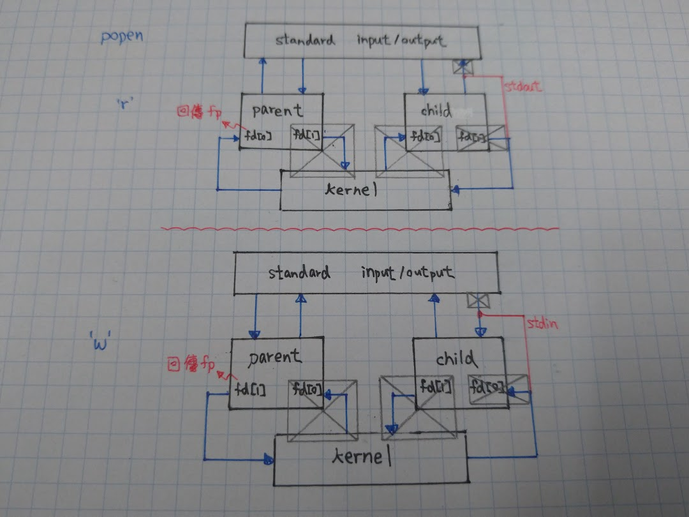

# Classical Inter-Process Communication

* [Classical Inter-Process Communication](#classical-inter-process-communication)
  * [Pipes](#pipes)
  * [FIFOs](#fifos)
  * [XSI (SysV) IPC](#xsi-sysv-ipc)
    * [Message Queues](#message-queues)
    * [Semaphores](#semaphores)
    * [Shared Memory](#shared-memory)

## Pipes

* Pipes
  * oldest UNIX IPC
  * half duplex
    * modern system has full duplex pipe
    * not suggest to use because of portability
  * can be used only between processes have common ancestor
  * normal steps
    * process create pipe
    * process calls `fork(2)`
    * pipe then can be used between parent and child
* `pipe(2)`: `int pipe(int pipefd[2]);`
  * return: 0 OK, -1 error
  * `pipefd[0]` is opened for reading
  * `pipefd[1]` is opened for writing
  * a pipe in a single process is useless
  * as the pipe is half duplex, the following actions may apply
    * child send to parent
      * parent close `pipefd[1]`
      * child close `pipefd[0]`
    * parent send to child
      * parent close `pipefd[0]`
      * child close `pipefd[1]`
  * example

  ``` C
  int fd[2];
  if (pipe(fd) < 0) {
    printf("err\n");
  }
  if ((pid = fork()) < 0) {
    printf("err\n");
  } else if (pid > 0) {
    close(fd[0]);
    write(fd[1], "hello world\n", 12);
  } else {
    close(fd[1]);
    n = read(fd[0], line, 256);
    write(STDOUT_FILENO, line, n);
  }
  ```

  * can be used for process synchronization

  ``` C
  static int pfd1[2];

  void TELL_WAIT() {
    if (pipe(pfd1) < 0)
      printf("err");
  }

  void WAIT_PARENT() {
    char c;
    if (read(pfd1[0]), &c, 1) != 1)
      printf("err");
    if (c != 'p')
      printf("incorrect data");
  }

  void TELL_CIHLD(pid_t pid) {
    if (write(pfd1[1], "p", 1) != 1)
      printf("err");
  }
  ```

* `popen(3)`: `FILE *popen(const char *command, const char *type);`
  * return: file pointer if OK, `NULL` on error
  * execute `command` and access it standard I/O
  * read from its `stdout` or write to its `stdin`
  * half-duplex, cannot read/write at the same time
  * internal implementation
    * check `type[0]` is `'r'` or `'w'`
    * `calloc(3)`: create buffer for `popen(2)` children PIDs
    * `pipe(2)`: create pipe
    * `fork(2)`: fork child
    * child
      * `close(2)`: close unused file descriptor
      * `dup2(2)`: configure the descriptor to standard I/O
        * `'r'`: `close(pfd[0])`, `dup2(pfd[1], STDOUT_FILENO);`, `close(pfd[1])`
        * `'w'`: `close(pfd[1])`, `dup2(pfd[0], STDIN_FILENO);`, `close(pfd[0])`
      * `exec(3)`: execute `command`
    * parent
      * `close(2)`: close unused file descriptor
      * `fdopen(3)`: open another file descriptor
        * `'r'`: `close(pfd[1])`, `fdopen(pfd[0], 'r');`
        * `'w'`: `close(pfd[0])`, `fdopen(pfd[1], 'w');`
      * set the buffer to remember child pid for the file descriptor
      * return file pointer

  
* `pclose(3)`: `int pclose(FILE *stream);`
  * return: exit status, -1 error
  * internal implementation
    * `fileno(3)`: get file descriptor from file pointer
    * get `pid` from the buffer, set that element to zero
    * `fclose(3)`: close file pointer
    * `waitpid(2)`: wait for `pid` and store status
    * return status
* `popen(2)` Example

  ``` C
  int main() {
    int c;
    while ((c = getchar()) != EOF) {
      if (isupper(c)) c = tolower(c);
      if (putchar(c) == EOF) printf("err");
      if (c == '\n') fflush(stdout);
    }
  }
  ```

  ``` C
  int main() {
    char line[MAXLINE];
    FILE *fpin;
    if ((fpin = popen("./myuclc", "r")) == NULL)
      printf("err");
    while (1) {
      fputs("prompt> ", stdout);
      fflush(stdout);
      if (fgets(line, MAXLINE, fpin) == NULL)
        break;
      if (fputs(line, stdout) == EOF)
        printf("err");
    }
    if (pclose(fpin) == -1)
      printf("err");
    putchar('\n');
  }
  ```

  ``` bash
  $ ./filter
  prompt> abcdEFGH
  abcdefgh
  prompt> ^C
  $
  ```

* Coprocess
  * input and output are associated with the same program
  * two pipes are needed
  * cannot use `popen(3)`, need to `fork(2)`, `close(2)`, `dup2(2)` from scratch

  ``` C
  int main(void) {
    int n, fd1[2], fd2[2];
    pid_t pid;
    char line[MAXLINE];
    if (signal(SIGPIPE, sig_pipe) == SIG_ERR) err_sys("signal error");
    if (pipe(fd1) < 0 || pipe(fd2) < 0) err_sys("pipe error");
    if ((pid = fork()) < 0) {
      err_sys("fork error");
    } else if (pid > 0) { /* parent */
      close(fd1[0]);
      close(fd2[1]);
      while (fgets(line, MAXLINE, stdin) != NULL) {
        n = strlen(line);
        if (write(fd1[1], line, n) != n) err_sys("write error to pipe");
        if ((n = read(fd2[0], line, MAXLINE)) < 0)
          err_sys("read error from pipe");
        if (n == 0) {
          err_msg("child closed pipe");
          break;
        }
        line[n] = 0; /* null terminate */
        if (fputs(line, stdout) == EOF) err_sys("fputs error");
      }
      if (ferror(stdin)) err_sys("fgets error on stdin");
      exit(0);
    } else { /* child */
      close(fd1[1]);
      close(fd2[0]);
      if (fd1[0] != STDIN_FILENO) {
        if (dup2(fd1[0], STDIN_FILENO) != STDIN_FILENO)
          err_sys("dup2 error to stdin");
        close(fd1[0]);
      }
      if (fd2[1] != STDOUT_FILENO) {
        if (dup2(fd2[1], STDOUT_FILENO) != STDOUT_FILENO)
          err_sys("dup2 error to stdout");
        close(fd2[1]);
      }
      if (execl("./add2", "add2", (char *)0) < 0) err_sys("execl error");
    }
    exit(0);
  }
  ```

  * if coprocess is implemented using standard I/O?
    * not work
    * because of I/O buffering mode
      * when standard I/O are not terminal devices, they are fully buffered
    * solution: need pseudo-terminals devices to emulate the line buffer or unbuffered channel

## FIFOs

* First In First Out
  * sometimes called named pipes
  * pipes can be only used between processes of a common ancestor
  * but FIFO can used between unrelated processes
  * `mkfifo(3)`: `int mkfifo(const char *pathname, mode_t mode);`
    * return: 0 OK, -1 error
    * if `O_NONBLOCK` is not specified (normal case)
      * open for read-only blocks until others write
      * open for write-only blocks until others read
    * if `O_NONBLOCK` is specified
      * open for read-only returns immediately
      * open for write-only returns -1 with errno `ENXIO` if no others read
* Data Passing
  * `tee`: read from standard input and write to standard output and files

  
* Client-Server Communication
  * one-way communication

    
  * two-way communication

    

## XSI (SysV) IPC

* XSI: X/Open System Interface
  * three types of XSI IPC
    * message queue
    * semaphore
    * shared memory
  * common user commands
    * `ipcs`: show information on IPC facilities
    * `ipcrm`: remove certain IPC resources
  * IPC identifiers
    * each IPC structure is referred to non-negative integer
    * but the identifier is an internal name for an IPC object
      * naming scheme is needed to refer the same IPC object - the IPC keys
    * IPC keys
      * a key must be specified whenever IPC object is being created
      * datatype `key_t`
      * then, the identifier of the referred IPC object is returned
  * share of IPC objects
    * server creates an IPC object with a key of `PIC_PRIVATE`
      * the identifier can be passed by storing in a file, or
      * fork a child which inherits the identifier
    * server and client can agree on a key by defining the key in a common header
    * server and client can agree on a pathname and a project ID
      * generate key by `ftok(3)`
      * `key_t ftok(const char *pathname, int proj_id);`
        * return: key OK, -1 error
        * `pathname` must be an existing file
        * `id` is a 8-bit non-zero number
* Advantages
  * reliable
  * support flow control
  * record based
  * can be processed in other than FIFO order
* Disadvantages
  * IPC data may left in the system even if no one refers to it
  * different from file system objects, i.e. no descriptors
  * need a different set of system calls to manipulate them

### Message Queues

* Message Queues
  * linked list of messages
  * `msgget(2)`: `int msgget(key_t key, int msgflg);`
    * return: message queue identifier, -1 error
    * creating or opening a message queue
    * upon creating, least significant 9 bits of `msgflg` define the permissions
    * `msgflg` can be combination of `IPC_CREAT` and `IPC_EXCL`
* System Limitations

  ``` bash
  $ ipcs -l  # ipcs -Q on BSD and MAC OS X
  ------ Messages Limits --------
  max queues system wide = 32000
  max size of message (bytes) = 8192
  default max size of queue (bytes) = 16384
  ...
  ```

* Controlling a Message Queue
  * `msgctl(2)`: `int msgctl(int msqid, int cmd, struct msqid_ds *buf);`
    * return: 0 OK, -1 error
    * `cmd`
      * `IPC_STAT`: retrieve the internal data
      * `IPC_SET`: set the internal data
        * only superuser is able to increase `msg_qbytes`
      * `IPC_RMID`: remove the queue immediately

    ``` C
    struct msqid_ds {
      struct ipc_perm msg_perm;     /* Ownership and permissions */
      time_t          msg_stime;    /* Time of last msgsnd(2) */
      time_t          msg_rtime;    /* Time of last msgrcv(2) */
      time_t          msg_ctime;    /* Time of last change */
      unsigned long   __msg_cbytes; /* Current number of bytes in queue (nonstandard) */
      msgqnum_t       msg_qnum;     /* Current number of messages in queue */
      msglen_t        msg_qbytes;   /* Maximum number of bytes allowed in queue */
      pid_t           msg_lspid;    /* PID of last msgsnd(2) */
      pid_t           msg_lrpid;    /* PID of last msgrcv(2) */
    };

    struct ipc_perm {
      key_t          __key;       /* Key supplied to msgget(2) */
      uid_t          uid;         /* Effective UID of owner */
      gid_t          gid;         /* Effective GID of owner */
      uid_t          cuid;        /* Effective UID of creator */
      gid_t          cgid;        /* Effective GID of creator */
      unsigned short mode;        /* Permissions */
      unsigned short __seq;       /* Sequence number */
    };
    ```

* Send a Message into Queue
  * `msgsnd(2)`: `int msgsnd(int msqid, const void *msgp, size_t msgsz, int msgflg);`
    * return: 0 OK, -1 error
    * `msgp` point to `struct msgbuf`

      ``` C
      struct msgbuf {
        long mtype;       /* message type, must be > 0 */
        char mtext[1];    /* message data */
      };
      ```
  
    * `msgflg`
      * `IPC_NOWAIT`: non-blocking access to the queue
      * if the queue is full and `IPC_NOWAIT` is specified
        * it returns error with `errno` set to `EAGAIN`

* Receive a Message from Queue
  * `msgrcv(2)`: `ssize_t msgrcv(int msqid, void *msgp, size_t msgsz, long msgtyp, int msgflg);`
    * return: number of bytes copied into `mtext` array, -1 error
    * `msgtype`
      * 0: the first message is returned
      * \>0: the first message whose type equals `msgtype` is returned
      * <0: the first message whose type is the lowest value less than or equal to `abs(msgtype)` is returned
    * `msgflg`
      * `IPC_NOWAIT`: non-blocking access to the queue
      * `MSG_EXCEPT`: `msgtype` \>0, the first message whose type has a non-equal type is returned
      * `MSG_NOERROR`: if received message has a longer size than n bytes, it is truncated and returned
* Example

  ``` C
  #define MESSAGE "hello, world!"

  struct msgbuf {
    long mtype;    /* message type, must be > 0 */
    char mtext[0]; /* message data */
  };

  int main() {
    int qid = -1, rlen, wlen;
    char buf[1024];
    pid_t pid;
    struct msgbuf *msg = (struct msgbuf *)buf;
    if ((qid = msgget(IPC_PRIVATE, IPC_CREAT | IPC_EXCL | 0660)) < 0)
      err_sys("msgget");
    if ((pid = fork()) < 0) err_sys("fork");
    if (pid == 0) {
      msg->mtype = 0;
      if ((rlen = msgrcv(qid, msg, sizeof(buf) - sizeof(*msg), 0, 0)) < 0)
        err_sys("msgrcv");
      printf("[%ld] %s (%u bytes)\n", msg->mtype, msg->mtext, rlen);
    } else {
      msg->mtype = 1024;
      wlen = snprintf(msg->mtext, sizeof(buf) - sizeof(*msg), "%s", MESSAGE);
      if (msgsnd(qid, msg, wlen + 1, 0) < 0)
        perror("msgsnd");
      else if (wait(&wlen) < 1)
        perror("wait");
      if (qid >= 0)
        if (msgctl(qid, IPC_RMID, NULL) < 0) err_sys("msgctl(RMID)");
    }
    return 0;
  }
  ```

### Semaphores

* Semaphores
  * shared counter
  * procedures
    1. test the semaphore
    2. if positive, the process can use the resource -> decrements the semaphore value by 1
    3. if the value of the semaphore is 0 -> process goes to sleep until value is positive
  * independent of semaphore creation (`semget(2)`) and initialization (`semctl(2)`)
    * may be a problem as we cannot atomically create a new semaphore set and initialize them
  * all XSI IPC objects are not release automatically
    * need to worry about termination without releasing semaphores
    * this can be solved by the semaphore `SEM_UNDO` feature
* `semget(2)`: `int semget(key_t key, int nsems, int semflg);`
  * return: semaphore set identifier, -1 error
  * upon creating, the least significant 9 bits of `semflg` define the permissions
  * `semflg` can be combination of `IPC_CREAT` and `IPC_EXCL`
* System Limitations

  ``` bash
  $ ipcs -l  # ipcs -Q on BSD and MAC OS X
  ...
  ------ Semaphore Limits --------
  max number of arrays = 32000
  max semaphores per array = 32000
  max semaphores system wide = 1024000000
  max ops per semop call = 500
  semaphore max value = 32767
  ```

* Controlling Semaphores
  * `semctl(2)`: `int semctl(int semid, int semnum, int cmd, ...)`
    * return: depends on commands, -1 error
    * kernel maintains member in semaphore set
      | Name      | Description                                         |
      | :-------- | :-------------------------------------------------- |
      | `semval`  | semaphore value, always >= 0                        |
      | `sempid`  | pid for last operation                              |
      | `semncnt` | # of processes waiting for the `semval` to increase |
      | `semzcnt` | # of processes waiting for the `semval` to be zero  |

    ``` C
    union semun {
      int              val;    /* Value for SETVAL */
      struct semid_ds *buf;    /* Buffer for IPC_STAT, IPC_SET */
      unsigned short  *array;  /* Array for GETALL, SETALL */
      struct seminfo  *__buf;  /* Buffer for IPC_INFO (Linux-specific) */
    };

    struct semid_ds {
      struct ipc_perm sem_perm;  /* Ownership and permissions */
      time_t          sem_otime; /* Last semop time */
      time_t          sem_ctime; /* Last change time */
      unsigned long   sem_nsems; /* No. of semaphores in set */
    };

    struct ipc_perm {
      key_t          __key;       /* Key supplied to msgget(2) */
      uid_t          uid;         /* Effective UID of owner */
      gid_t          gid;         /* Effective GID of owner */
      uid_t          cuid;        /* Effective UID of creator */
      gid_t          cgid;        /* Effective GID of creator */
      unsigned short mode;        /* Permissions */
      unsigned short __seq;       /* Sequence number */
    };
    ```

    * `cmd`
      |  Command   | Description                                                             |
      | :--------: | :---------------------------------------------------------------------- |
      | `IPC_STAT` | Retrieve the internal `semid_ds` data structure and stores in `arg.buf` |
      | `IPC_SET`  | Set the internal `semid_ds` data structure by `arg.buf`                 |
      | `IPC_RMID` | Remove the semaphore (immediately)                                      |
      |  `GETVAL`  | Return the value of semnum-th member                                    |
      |  `SETVAL`  | Set the value of semnum-th member by `arg.val`                          |
      |  `GETPID`  | Return the value of `sempid` for the semnum-th member                   |
      | `GETNCNT`  | Return the value of `semncnt` for the semnum-th member                  |
      | `GETZCNT`  | Return the value of `semzcnt` for the semnum-th member                  |
      |  `GETALL`  | Retrieve all semaphore values, returned by `arg.array`                  |
      |  `SETALL`  | Set all semaphore values by `arg.array`                                 |
* Semaphore Operations
  * `semop(2)`: `int semop(int semid, struct sembuf *sops, size_t nsops);`
    * return: 0 OK, -1 error

    ``` C
    struct sembuf {
      unsigned short sem_num;  /* semaphore number */
      short          sem_op;   /* semaphore operation */
      short          sem_flg;
    };
    ```

    * `sem_op` is positive, added to the semaphore's value
      * if `SEM_UNDO` is specified, `sem_op` is subtracted from the semaphore's adjustment value for this process
    * `sem_op` is negative
      * if resources are available (|`sem_op`| >= `sem_val`)
        * |`sem_op`| is subtracted from the semaphore's value
        * if `SEM_UNDO` is specified, |`sem_op`| is added to the semaphore's adjustment value for this process
      * if resources are not available (|`sem_op`| < `sem_val`)
        * if `IPC_NOWAIT` is specified, `semop(2)` returns an error of `EAGAIN`
        * if `IPC_NOWAIT` is not specified
          * the `semncnt` value for this semaphore is increased
          * the process is suspended until
            * the semaphore's value becomes greater or equal to the |`sem_op`|, the `semncnt` should be increased
            * the semaphore is removed from the system: `semop(2)` returns an error of `EIDRM`
            * it is interrupted by a signal: `semop(2)` returns an error of `EINTR`
    * `sem_op` is zero
      * wait until the semaphore's value becomes 0
      * if the value is currently 0, the function returns immediately, otherwise
      * if `IPC_NOWAIT` is specified, return is made with an error of `EAGAIN`
      * if `IPC_NOWAIT` is not specified
        * the `semzcnt` value for this semaphore is incremented
        * the process is suspended until
          * the semaphore's value becomes 0, the `semzcnt` should be increased
          * the semaphore is removed from the system: `semop(2)` returns an error of `EIDRM`
          * it is interrupted by a signal: `semop(2)` returns an error of `EINTR`
* Semaphore Adjustment on Terminating a Process
  * a program's termination without releasing semaphores may block future access
  * the problem can be solved by the `SEM_UNDO` feature
    * When we specify the `SEM_UNDO` flag for a semaphore operation
    * the kernel remembers how many resources we allocated from that particular semaphore
    * when the process terminates, the kernel checks whether the process has any outstanding semaphore adjustments, i.e., the value is > 0
    * if so, applies the adjustment to the corresponding semaphore
      * `semval` is increased by the adjustments

### Shared Memory

* Shared Memory
  * fastest form of IPC
    * data does not to be copied
    * but need to synchronize access to a given region
    * synchronizing can be done by semaphores
* Creating or Opening a Shared Memory
  * `shmget(2)`: `int shmget(key_t key, size_t size, int shmflg);`
    * return: shared memory identifier, -1 error
    * upon creating, the lease significant 9 bits of `shmflg` define the permissions
    * `shmflg` can be combination of `IPC_CREAT` and `IPC_EXCL`
    * actual size is round up to multiples of `PAGE_SIZE`
    * when created, it's content initialized to all zero
* System Limitations

  ``` bash
  $ ipcs -l  # ipcs -Q on BSD and MAC OS X
  ...
  ------ Shared Memory Limits --------
  max number of segments = 4096
  max seg size (kbytes) = 262144
  max total shared memory (kbytes) = 18014398509481980
  min seg size (bytes) = 1
  ...
  ```

* Controlling Shared Memory
  * `shmctl(2)`: `int shmctl(int shmid, int cmd, struct shmid_ds *buf);`
    * return: 0 OK, -1 error

    ``` C
    struct shmid_ds {
      struct ipc_perm shm_perm;    /* Ownership and permissions */
      size_t          shm_segsz;   /* Size of segment (bytes) */
      time_t          shm_atime;   /* Last attach time */
      time_t          shm_dtime;   /* Last detach time */
      time_t          shm_ctime;   /* Last change time */
      pid_t           shm_cpid;    /* PID of creator */
      pid_t           shm_lpid;    /* PID of last shmat(2)/shmdt(2) */
      shmatt_t        shm_nattch;  /* No. of current attaches */
      ...
    };

    struct ipc_perm {
      key_t          __key;    /* Key supplied to shmget(2) */
      uid_t          uid;      /* Effective UID of owner */
      gid_t          gid;      /* Effective GID of owner */
      uid_t          cuid;     /* Effective UID of creator */
      gid_t          cgid;     /* Effective GID of creator */
      unsigned short mode;     /* Permissions + SHM_DEST and SHM_LOCKED flags */
      unsigned short __seq;    /* Sequence number */
    };
    ```

    * `cmd`
      * `IPC_STAT`: Retrieve the internal `shmid_ds` data structure
      * `IPC_SET`: Set the internal `shmid_ds` data structure
      * `IPC_RMID`: Remove the shared memory, but it is actually removed until the last process using the segment terminates or detaches it
      * `SHM_LOCK`: Make the shared memory not swappable
      * `SHM_UNLOCK`: Make the shared memory swappable
        * the two commands can be only used y superuser
* Attach a Shared Memory
  * `shmat(2)`: `void *shmat(int shmid, const void *shmaddr, int shmflg);`
    * return: address of the attached shared memory, (void *)-1 error
    * `shmaddr`
      * `NULL`
        * the segment is attached at the first available address selected by the kernel (recommended)
      * not `NULL` and `SHM_RND` is not specified
        * the segment is attached at the address given by `addr`
      * not `NULL` and `SHM_RND` is specified
        * the segment is attached at the address given by `addr` - `addr modulus SHMLBA` (round down to the multiples of `SHMLBA`)
    * `flag`
      * if the `SHM_RDONLY` bit is specified in `flag`, the segment is attached read-only
* Detach a Shared Memory
  * `shmdt(2)`: `int shmdt(void *addr)`
    * return: 0 OK, -1 error
